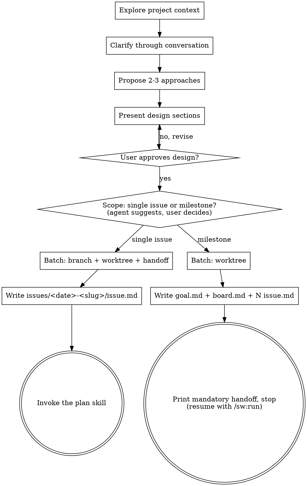

# Brainstorm — Ideas Into Issues and Milestones

Help turn ideas into fully formed designs through natural collaborative dialogue, then write them down as **issues** — specwright's single unit of work (1 issue = 1 branch = 1 PR). Small work becomes one standalone issue; a large delivery becomes a **milestone**: a goal, a board, and several issues conducted later by `/sw:run`.

<HARD-GATE>
Do NOT invoke any implementation skill, write any code, scaffold any project, or take any implementation action until you have presented a design and the user has approved it. This applies to EVERY project regardless of perceived simplicity.
</HARD-GATE>

## Anti-Pattern: "This Is Too Simple To Need A Design"

Every project goes through this process. A todo list, a single-function utility, a config change — all of them. "Simple" projects are where unexamined assumptions cause the most wasted work. The design can be short (a few sentences for truly simple projects), but you MUST present it and get approval.

## Anti-Pattern: Forcing Decisions Too Early

A brainstorm is a conversation, not a form. Explore in open prose first — sketch the concept, surface tensions and trade-offs, react to what the user says. Reserve structured multiple-choice questions for genuinely final, well-understood decisions. Never push the user to decide something before the full picture is on the table.

## Checklist

You MUST create a task for each of these items and complete them in order:

1. **Explore project context** — check files, docs, recent commits
2. **Offer visual companion** (if the topic will involve visual questions) — its own message, nothing else in it. See the Visual Companion section below.
3. **Clarify through conversation** — understand purpose, constraints, success criteria; decisions come at the end
4. **Propose 2-3 approaches** — with trade-offs and your recommendation
5. **Present design** — in sections scaled to their complexity, get user approval
6. **Conclude the scope** — after approval, state whether this is a **single issue** or a **milestone**, with your reasoning (and, for a milestone, a preview of the decomposition: issue slugs, one-liners, dependencies). The user decides. The shape of the work is a conclusion of the design, not a command choice.
7. **Post-design batch** — one batch, per shape (see below).
8. **Write the artifacts** — per shape (see below). Commit them.
9. **Next step** — single issue: invoke the plan skill (`/sw:plan`). Milestone: print the mandatory handoff and stop.

## Process Flow



## Judging the scope

While designing, keep asking: does this decompose into several independently shippable deliveries? Signals of a milestone: the solution spans multiple layers or areas (backend + admin + frontend + email), the decomposition has internal dependencies, no single PR could carry it reviewably. When you see it, **suggest** the milestone with a preview — never force it, and never mention it for work that fits one issue (a flag, a fix, one endpoint).

If the user describes something too large even for one milestone, help decompose into milestones first; each gets its own brainstorm.

## Single issue — batch and artifacts

**Batch (one message, exactly three things):** confirm the **branch name**, choose whether to use a **worktree**, and whether to **hand off** before implementing.

**Worktree guard** — before asking, detect whether you are already inside a linked git worktree:

```bash
[ "$(git rev-parse --git-common-dir)" != "$(git rev-parse --git-dir)" ] && echo "already in a linked worktree"
```

- **Already in a linked worktree** → warn the user (name the path) and recommend **no** — work in place.
- **Not in a worktree** → the default is **yes**: `git worktree add .specwright/worktrees/<slug> -b <branch>` and `cd` in before writing the issue. specwright only ever **creates** worktrees — never removes one; cleanup is the maintainer's after merge.

When worktree = no, create the branch in place: `git checkout -b <branch>`.

**Artifact:** write `.specwright/issues/YYYY-MM-DD-<slug>/issue.md` from the bundled template (`scaffold/templates/issue.md`, under the installed `sw` skill or `skills/sw/` in the specwright dev repo): Purpose, Motivation, Non-Goals, numbered `AC-N` acceptance criteria, frontmatter `status: pending`. This is the durable record of the approved design — not a second review gate. Commit it.

**Next:** handoff = yes → print a ```txt``` handoff (one-paragraph summary + the issue path; first line `cd .specwright/worktrees/<slug>` when one was created) and stop — the user resumes in a fresh context. Handoff = no → invoke the plan skill now. Approval of the design is the standing consent to commit, push the feature branch, open the PR, and run review to `lgtm` — the pipeline runs to the end without further asks.

## Milestone — batch and artifacts

**Batch (one message, exactly one thing):** whether issue owners run in **worktrees** under `.specwright/worktrees/` (default **yes**; answering no forces serial in-place conduction — parallel dispatch requires worktrees).

**Artifacts:** write `.specwright/milestones/YYYY-MM-DD-<slug>/` from the bundled templates (`scaffold/templates/`):

- `goal.md` — the milestone's Purpose, Motivation, Success Criteria, Non-Goals. Stable; editing it later is a scope change no agent does alone.
- `board.md` — the Issues table (order, slug, depends-on), empty Dispatch Log and Blockers. Order and dependencies live ONLY here.
- `issues/<slug>/issue.md` — one per issue, plain kebab slugs (no number prefixes — order is board data), each with Purpose, Non-Goals, `AC-N`, `status: pending`. The approved decomposition IS the design approval for every issue: `/sw:run` goes straight to planning, with no brainstorm per issue.

Commit the milestone folder.

**Mandatory handoff — the planning session never conducts.** After a long brainstorm the context is full of exploration: dead ends, rejected decompositions, half-decisions. The orchestrator must be born clean, reading only the artifacts. Print a ```txt``` handoff (one-paragraph summary + the milestone path + `/sw:run <slug>` as the resume command) and **stop**. No exceptions, no "start now".

## The Process

**Understanding the idea:**

- Check out the current project state first (files, docs, recent commits)
- Converse in prose; one topic at a time; keep questions open while the picture is forming
- Focus on understanding: purpose, constraints, success criteria

**Exploring approaches:**

- Propose 2-3 different approaches with trade-offs
- Lead with your recommended option and explain why

**Presenting the design:**

- Present in sections scaled to complexity; ask whether each looks right
- Cover: architecture, components, data flow, error handling, testing
- Design for isolation and clarity: units with one purpose, well-defined interfaces, independently understandable. If you can't change a unit's internals without breaking its consumers, the boundaries need work.
- In existing codebases: explore the structure first, follow existing patterns, include targeted improvements where existing problems affect the work — never unrelated refactoring.

**Writing acceptance criteria (the loop's exit condition):**

- Every `AC-N` must be binary, observable, and checkable in under a minute — they are what runtime verification and `/sw:review` later prove. "Make the tests pass" is a good goal; "improve the code" never terminates.

## Key Principles

- **Converse first, decide at the end** — structured questions only for final, well-understood choices
- **YAGNI ruthlessly** — remove unnecessary features from all designs
- **Explore alternatives** — always propose 2-3 approaches before settling
- **Incremental validation** — present design, get approval before moving on
- **Be flexible** — go back and clarify when something doesn't make sense

## Visual Companion

A browser-based companion for showing mockups, diagrams, and visual options during brainstorming. Available as a tool — not a mode of operation. Accepting it means it's available for questions that benefit from visual treatment; it does NOT mean every question goes through the browser.

**Offering the companion:** when you anticipate visual content (mockups, layouts, diagrams), offer it once for consent:
> "Some of what we're working on might be easier to explain if I can show it to you in a web browser. I can put together mockups, diagrams, comparisons, and other visuals as we go. This feature is still new and can be token-intensive. Want to try it? (Requires opening a local URL)"

**This offer MUST be its own message** — no other content. Wait for the response; if declined, proceed text-only.

**Per-question decision:** even after acceptance, decide per question — would the user understand this better by seeing it than reading it? Browser for content that IS visual (mockups, wireframes, architecture diagrams, side-by-side comparisons); terminal for text (requirements, concepts, trade-off lists, scope decisions).

If they agree, read the sibling `visual-companion.md` before proceeding.
