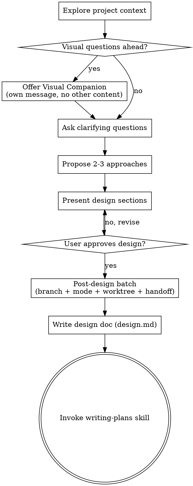

# Brainstorming Ideas Into Designs

Help turn ideas into fully formed designs and specs through natural collaborative dialogue.

Start by understanding the current project context, then ask questions one at a time to refine the idea. Once you understand what you're building, present the design and get user approval.

<HARD-GATE>
Do NOT invoke any implementation skill, write any code, scaffold any project, or take any implementation action until you have presented a design and the user has approved it. This applies to EVERY project regardless of perceived simplicity.
</HARD-GATE>

## Anti-Pattern: "This Is Too Simple To Need A Design"

Every project goes through this process. A todo list, a single-function utility, a config change — all of them. "Simple" projects are where unexamined assumptions cause the most wasted work. The design can be short (a few sentences for truly simple projects), but you MUST present it and get approval.

## Checklist

You MUST create a task for each of these items and complete them in order:

1. **Explore project context** — check files, docs, recent commits
2. **Offer visual companion** (if topic will involve visual questions) — this is its own message, not combined with a clarifying question. See the Visual Companion section below.
3. **Ask clarifying questions** — one at a time, understand purpose/constraints/success criteria
4. **Propose 2-3 approaches** — with trade-offs and your recommendation
5. **Present design** — in sections scaled to their complexity, get user approval after each section
6. **Post-design batch** — once the design is approved, ask in **one** batch exactly four things: confirm the **branch name**, choose the **mode** (`autonomous` | `reviewed`), choose whether to use a **worktree**, and whether to **hand off** before implementing. Record the branch, mode, and worktree choice — writing-plans writes them into `spec.md` frontmatter when it creates the technical spec.
7. **Write the design doc** — save the non-technical write-up of the approved design to `.specwright/specs/YYYY-MM-DD-<slug>/design.md` (Purpose/Motivation/Definitions/Non-Goals) and commit. This captures *why*; it is **not** a second human-review gate.
8. **Transition to implementation** — invoke writing-plans skill → it writes the fused technical `spec.md` + `tasks.md`, **self-reviews the spec** (spec-document-reviewer subagent + `/sw:review-spec` + `validate-spec.sh`, both modes, no human gate), then follows the `AGENTS.md` `### Spec flow` tail: **handoff (either mode)** → after design/spec/tasks exist, print a ```` ```txt ```` handoff prompt and stop (never hand off earlier); otherwise implement → quality gate, then **deliver per mode** — `autonomous` opens the PR + runs the `sw:code-review` cycle to `lgtm` on its own; `reviewed` first asks "open the PR and run code-review?".

## Process Flow



**The terminal state is invoking writing-plans.** Do NOT invoke frontend-design, mcp-builder, or any other implementation skill. The ONLY skill you invoke after brainstorming is writing-plans.

## The Process

**Understanding the idea:**

- Check out the current project state first (files, docs, recent commits)
- Before asking detailed questions, assess scope: if the request describes multiple independent subsystems (e.g., "build a platform with chat, file storage, billing, and analytics"), flag this immediately. Don't spend questions refining details of a project that needs to be decomposed first.
- If the project is too large for a single spec, help the user decompose into sub-projects: what are the independent pieces, how do they relate, what order should they be built? Then brainstorm the first sub-project through the normal design flow. Each sub-project gets its own design → spec → implementation cycle.
- For appropriately-scoped projects, ask questions one at a time to refine the idea
- Prefer multiple choice questions when possible, but open-ended is fine too
- Only one question per message - if a topic needs more exploration, break it into multiple questions
- Focus on understanding: purpose, constraints, success criteria

**Exploring approaches:**

- Propose 2-3 different approaches with trade-offs
- Present options conversationally with your recommendation and reasoning
- Lead with your recommended option and explain why

**Presenting the design:**

- Once you believe you understand what you're building, present the design
- Scale each section to its complexity: a few sentences if straightforward, up to 200-300 words if nuanced
- Ask after each section whether it looks right so far
- Cover: architecture, components, data flow, error handling, testing
- Be ready to go back and clarify if something doesn't make sense

**Design for isolation and clarity:**

- Break the system into smaller units that each have one clear purpose, communicate through well-defined interfaces, and can be understood and tested independently
- For each unit, you should be able to answer: what does it do, how do you use it, and what does it depend on?
- Can someone understand what a unit does without reading its internals? Can you change the internals without breaking consumers? If not, the boundaries need work.
- Smaller, well-bounded units are also easier for you to work with - you reason better about code you can hold in context at once, and your edits are more reliable when files are focused. When a file grows large, that's often a signal that it's doing too much.

**Working in existing codebases:**

- Explore the current structure before proposing changes. Follow existing patterns.
- Where existing code has problems that affect the work (e.g., a file that's grown too large, unclear boundaries, tangled responsibilities), include targeted improvements as part of the design - the way a good developer improves code they're working in.
- Don't propose unrelated refactoring. Stay focused on what serves the current goal.

## After the Design

**Post-design batch (ask once, right after the design is approved):**
In **one** batch, ask exactly four things: confirm the **branch name**, choose the **mode** (`autonomous` | `reviewed`), choose whether to use a **worktree**, and whether to **hand off** before implementing. Record the branch, mode, and worktree choice — writing-plans writes them into `spec.md` frontmatter when it creates the technical spec; the recorded `mode:` is the standing authorization to commit and push the feature branch. There is no PR question; a PR is always the delivery — the mode only decides whether the agent opens it on its own.

- **`autonomous`** — the recorded mode tells the agent to run all the way to delivery on its own: write design → writing-plans (spec + tasks + self-review) → implement → quality gate → open the PR (`/sw:new-pr`) → `sw:code-review` cycle to `lgtm`, with no further prompts.
- **`reviewed`** — identical up to and including the quality gate; then, before delivery, the agent **asks** "open the PR and run code-review?" and proceeds on your go-ahead.

**Worktree (the third question):** before asking, detect whether you are already inside a linked git worktree:

```bash
[ "$(git rev-parse --git-common-dir)" != "$(git rev-parse --git-dir)" ] && echo "already in a linked worktree"
```

- **Already in a worktree** (e.g. a harness checkout under `worktrees/`) → warn the user (name the path) and recommend **no** — work in place. The check keys on git-dir vs git-common-dir, so it is agent-agnostic and never hardcodes one agent's directory.
- **Not in a worktree** → the default is **yes**.

When worktree = **yes**, create the branch as a worktree under the git-ignored `.specwright/worktrees/<slug>` (where `<slug>` is the spec's dated-folder slug) and `cd` in before writing `design.md` — the rest of the flow runs there:

```bash
git worktree add .specwright/worktrees/<slug> -b <branch>
cd .specwright/worktrees/<slug>
```

When worktree = **no**, create the branch in place: `git checkout -b <branch>`. specwright only ever **creates** a worktree — it never removes one; cleanup is the maintainer's, done manually after merge. Record the choice as `worktree:` in `spec.md` frontmatter (the path, or `null` when unused).

Both modes self-review the spec and may use the handoff. The design-approval gate (step 5) is the **only** human review and is **never** skipped — there is **no** human spec-review gate and no "start implementation" gate.

**Documentation:**

- Write the non-technical design write-up to `.specwright/specs/YYYY-MM-DD-<slug>/design.md` — Purpose, Motivation, Definitions, Non-Goals. This is a durable record of the approved design's *why*; the technical *how* (architecture, file structure, acceptance criteria) is produced next by writing-plans in `spec.md`.
  - (User preferences for spec location override this default)
- Use elements-of-style:writing-clearly-and-concisely skill if available
- Commit `design.md` to git
- The spec **self-review** (spec-document-reviewer subagent + `/sw:review-spec` + `validate-spec.sh`) is **not** run here — it runs inside writing-plans, after the technical `spec.md` exists. There is no human spec-review gate; design approval already gated the work.

**Implementation handoff:**

- Invoke the writing-plans skill — it writes the fused technical `spec.md` + `tasks.md` and self-reviews the spec. Do NOT invoke any other skill — writing-plans is the next step.
- Once design + spec + tasks exist, follow the `AGENTS.md` `### Spec flow` tail:
  - **handoff = yes (either mode)** → print a ```` ```txt ```` **handoff prompt** (a one-paragraph summary + the paths to `design`/`spec`/`tasks` + the mode; if a worktree was created, its first line is `cd .specwright/worktrees/<slug>`) and stop. The user runs `/compact` (or opens a new chat) and pastes it to resume. **Never hand off before the artifacts exist** — the preference was recorded up front; the handoff is produced only now.
  - **handoff = no** → implement straight away.
  - **Delivery** (after implement → quality gate): `autonomous` opens the PR (`/sw:new-pr`) and runs the `sw:code-review` cycle to `lgtm` on its own; `reviewed` first asks "open the PR and run code-review?", then does the same.

## Key Principles

- **One question at a time** - Don't overwhelm with multiple questions
- **Multiple choice preferred** - Easier to answer than open-ended when possible
- **YAGNI ruthlessly** - Remove unnecessary features from all designs
- **Explore alternatives** - Always propose 2-3 approaches before settling
- **Incremental validation** - Present design, get approval before moving on
- **Be flexible** - Go back and clarify when something doesn't make sense

## Visual Companion

A browser-based companion for showing mockups, diagrams, and visual options during brainstorming. Available as a tool — not a mode. Accepting the companion means it's available for questions that benefit from visual treatment; it does NOT mean every question goes through the browser.

**Offering the companion:** When you anticipate that upcoming questions will involve visual content (mockups, layouts, diagrams), offer it once for consent:
> "Some of what we're working on might be easier to explain if I can show it to you in a web browser. I can put together mockups, diagrams, comparisons, and other visuals as we go. This feature is still new and can be token-intensive. Want to try it? (Requires opening a local URL)"

**This offer MUST be its own message.** Do not combine it with clarifying questions, context summaries, or any other content. The message should contain ONLY the offer above and nothing else. Wait for the user's response before continuing. If they decline, proceed with text-only brainstorming.

**Per-question decision:** Even after the user accepts, decide FOR EACH QUESTION whether to use the browser or the terminal. The test: **would the user understand this better by seeing it than reading it?**

- **Use the browser** for content that IS visual — mockups, wireframes, layout comparisons, architecture diagrams, side-by-side visual designs
- **Use the terminal** for content that is text — requirements questions, conceptual choices, tradeoff lists, A/B/C/D text options, scope decisions

A question about a UI topic is not automatically a visual question. "What does personality mean in this context?" is a conceptual question — use the terminal. "Which wizard layout works better?" is a visual question — use the browser.

If they agree to the companion, read the detailed guide before proceeding:
`skills/brainstorming/visual-companion.md`
