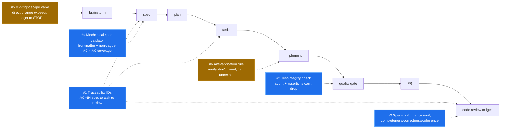

---
tags:
  - learning
  - concept
  - benchmark
related:
  - "[[tlc-spec-driven-workflow]]"
  - "[[openspec-workflow]]"
  - "[[mechanical-enforcement-over-prose]]"
  - "[[agents-md-as-map-not-encyclopedia]]"
created: 2026-06-14
---
# memex improvement insights — benchmarked against tlc-spec-driven and OpenSpec

Benchmarking memex against its two closest peers — [[tlc-spec-driven-workflow]] (a markdown skill, like memex, but deeper on per-task engineering rigor) and [[openspec-workflow]] (a compiled CLI that puts *mechanical* teeth on its spec artifacts) — exposes a clear pattern: **memex is the strongest of the three on lifecycle governance (branch/PR/mode, constitution, self-review, learnings vault) and the weakest on two things both peers do better — (a) closing the loop from acceptance criteria to verified implementation, and (b) defending against the agent's own failure modes.** This note distills only the high-impact, concretely-actionable transfers; low-impact ideas are explicitly parked. Source: the `2026-06-14-benchmark-spec-driven-tools` spec (see [[../specs/2026-06-14-benchmark-spec-driven-tools/spec|benchmark spec]]).

## Context

memex's flow is `brainstorm → spec → plan → tasks → implement → quality gate → PR → review-to-lgtm`, governed by `constitution.md` + `rules.md`, with specs as frozen history and a wikilinked `learnings/` vault as the living brain. The two peers solve the same problem (intent → verified shipped change + durable memory) with different bets. The comparison below is the basis for the recommendations.

## Capability comparison

| Capability | memex | tlc-spec-driven | OpenSpec |
|---|---|---|---|
| Medium | markdown skill + prose law | markdown skill (prose) | compiled CLI + Zod schemas |
| Scope adaptivity | binary (one-sentence test → direct vs spec) | **graded tiers + mid-flight safety valve** | profiles (core/custom), gate-free |
| Requirement → verification trace | acceptance criteria only | **traceability IDs spec→commit→validation** | delta requirements + scenarios |
| Defends vs AI failure modes | ✗ (prose quality gate) | **✓ test-count + assertion-integrity + anti-fabrication** | ✗ (verify is advisory) |
| Spec-conformance check before merge | partial (code-review vs *law*) | feature Validation vs AC + UAT | **`verify`: completeness/correctness/coherence** (advisory) |
| Mechanical artifact validation | prose self-review only | ✗ (all prose) | **✓ Zod schema + transactional merge** |
| Human review gate | **✓ design approval + autonomous/reviewed mode** | user confirm per phase | ✗ (host PR only) |
| Branch / PR discipline | **✓ one branch + PR per spec, `/memex:new-pr`** | ✗ (atomic commits only) | ✗ (archive = folder move) |
| Law layer (constitution/rules) | **✓** | ✗ (STATE.md only) | ✗ (config context/rules) |
| Living knowledge base | **✓ wikilinked learnings + reflection + GC** | STATE.md (AD/B/L) | the merged spec set |
| Resumability across context resets | compact handoff prompt | HANDOFF.md checkpoint | **✓ filesystem-derived status (re-run `status`)** |

**Reading:** the **bold** cells are each tool's edge. memex owns the right half (governance + knowledge); both peers beat it on the middle rows (trace + AI-failure defense + mechanical validation). That gap is the recommendation set.

## Where each insight plugs into the memex flow

## Recommendations (ranked, high-impact only)

Each names the concrete memex artifact it touches, the behavioral change, the source tool, and an impact rating. Low/unclear-impact ideas are in *Considered & parked* below, not here.

### 1. Acceptance-criteria traceability IDs — spec ↔ tasks ↔ review · **Impact: HIGH** · from tlc-spec-driven

- **Problem:** memex spec acceptance criteria are an unnumbered checklist. Nothing links a criterion to the task(s) that satisfy it or proves at review time that *every* criterion was verified — the loop TLC closes with `AUTH-01`-style IDs threaded spec→task→validation with a coverage line (`X total, Y mapped, Z unmapped ⚠️`).
- **Change:** give each acceptance criterion a stable ID (`AC-1`, `AC-2`, …) in the **spec template** (`.memex/specs/_template/spec.md`); have the **tasks template** reference the AC ID(s) each task satisfies; add a coverage check to **`memex-code-review`** (and `/memex:review-spec`) that fails if any AC ID is unreferenced by a task or unverified at review.
- **Why high:** turns "did we do everything?" from a judgment call into an auditable checklist; directly strengthens the existing quality gate and code-review verdict.

### 2. AI-failure-mode test-integrity check in the quality gate — **Impact: HIGH** · from tlc-spec-driven

- **Problem:** memex's quality gate says "logic added/changed in a tested area without a test → write the missing tests first," but has **no guard against the agent's own worst habit**: deleting, skipping, or weakening tests to make the gate go green. TLC enforces "test count must not silently decrease" + "weakened assertions = regression" + "never modify/weaken/skip/delete the RED tests."
- **Change:** add to the **AGENTS.md quality-gate step** and **`memex-code-review`** an explicit integrity rule — the touched area's test count must not drop and assertions must not be weakened/`skip`ped without an in-spec justification; code-review flags a silent test deletion as a **blocker**.
- **Why high:** in autonomous mode the agent both writes and grades its own work; this is the single highest-leverage trust mechanism, and memex currently lacks it entirely.

### 3. Spec-conformance "verify" dimension in code-review — **Impact: HIGH** · from OpenSpec

- **Problem:** `memex-code-review` reviews the diff against *project law* (rules/constitution/conventions). It does **not** systematically check the implementation against the **spec's own acceptance criteria**. OpenSpec's `verify` checks three explicit dimensions: **Completeness** (all tasks/requirements/scenarios done), **Correctness** (matches spec intent + edge cases), **Coherence** (design decisions reflected in code).
- **Change:** add a **spec-conformance pass** to `memex-code-review`: before the verdict, walk the spec's acceptance criteria (by AC ID from #1) and the plan's design decisions, and report completeness/correctness/coherence findings. Pairs naturally with #1.
- **Why high:** "passes lint + matches the rules" is not "does what the spec promised." This closes the gap between the law-review memex already does and the requirement-review it doesn't.

### 4. Mechanical validator for spec/plan/tasks artifacts — **Impact: HIGH** · from OpenSpec (reinforces [[mechanical-enforcement-over-prose]])

- **Problem:** memex's own [[mechanical-enforcement-over-prose]] learning says runnable checks beat written rules — yet the spec artifacts are validated only by *prose* self-review (`/memex:review-spec`). OpenSpec proves the opposite is cheap: a Zod schema rejects malformed artifacts deterministically before they propagate.
- **Change:** add a small validator script under **`skills/memex/scripts/`** (the repo already runs Python validators via `uv run --with pyyaml`) that checks a spec folder: required frontmatter keys (`status/feature/branch/mode/created`), no `{{placeholder}}` survivors, acceptance criteria present and free of banned vague verbs ("works", "fast", "robust" without a number), and (with #1) every AC ID referenced by a task. Wire it into **`/memex:review-spec`** as a feedforward gate so the prose review starts from a structurally-valid artifact.
- **Why high:** converts the most-rationalized-past failures (placeholder ACs, vague verbs, missing frontmatter) from "reviewer hopefully notices" to "script fails noisily" — exactly the Rule of Repair the constitution favors.

### 5. Mid-flight scope safety valve — **Impact: MEDIUM** · from tlc-spec-driven

- **Problem:** memex's entry gate is binary (one-sentence test → go direct, or spec flow). When a "go direct" change turns out larger than it looked, nothing forces a course-correction — the agent just keeps going. TLC's safety valve: even on the express lane, list the steps first; if it reveals **>5 steps / >3 files**, STOP and escalate into the full flow.
- **Change:** add one rule to the **AGENTS.md `## Workflow Spec Driven` decision block**: a direct (non-spec) change that, once underway, exceeds a small budget (e.g. >3 files or >5 non-trivial steps) must stop and re-enter the spec flow rather than continuing ad-hoc.
- **Why medium:** prevents scope-creep-without-a-spec, but fires less often than #1–#4 and is a single prose rule (no new machinery).

### 6. Anti-fabrication knowledge-verification rule — **Impact: MEDIUM** · from tlc-spec-driven

- **Problem:** `rules.md` has a Currency rule ("use latest docs") but no explicit **anti-fabrication chain**. TLC mandates `Codebase → Project docs → Context7 MCP → Web search → flag uncertain` with an absolute "say 'I don't know' rather than invent an API/pattern."
- **Change:** add a short rule to **`rules.md`** (Philosophy or a new "Knowledge" subsection): verify factual/API claims against the codebase/docs/Context7 before asserting them; when unverifiable, flag uncertainty explicitly rather than inventing. memex already wires Context7 — this makes the discipline a stated rule.
- **Why medium:** real failure-mode coverage at near-zero cost, but advisory prose without a mechanical check (unlike #2/#4).

## Considered & parked (deliberately not recommended)

Honoring "only things that clearly improve the flow":

- **Delta-spec merge into a living source-of-truth (OpenSpec).** Powerful, but **conflicts with the constitution** ("Specs never get deleted. Shipped specs remain in `.memex/specs/` as historical record"). memex's living layer is the learnings vault, not a merged spec base. Rejected.
- **Externalized YAML workflow schemas / profiles (OpenSpec).** memex's flow is already plain editable markdown (the README "Customizing" section); a schema engine adds a build/validation layer the constitution's "no build pipeline / markdown is source of truth" rule resists. Low marginal value.
- **Session HANDOFF.md checkpoint (TLC).** memex already prints a **compact handoff prompt** in the spec flow; a separate checkpoint file is redundant.
- **Brownfield 7-doc codebase mapping (TLC).** Heavy; memex's `conventions/` + `/memex:recall` + a target repo's own `.memex` partially cover it. Possible future, not high-impact now.
- **Graded complexity tiers as a full matrix (TLC).** memex's binary gate + recommendation #5 (the valve) capture most of the benefit without the Small/Medium/Large/Complex bookkeeping.
- **Filesystem-derived status engine (OpenSpec).** Elegant, but requires a CLI; memex's `status:`/`mode:` frontmatter + compact handoff already give resumability for its scale.

## How to Apply

Treat #1–#4 as a coherent bundle: **traceability IDs (#1)** give #2/#3/#4 something concrete to check, and together they convert memex's quality gate + code-review from "law compliance" into "law compliance **+** verified delivery of the spec." Implement them as separate future specs (this benchmark spec is analysis-only — see its Non-Goals). Start with **#4 (mechanical spec validator)** and **#2 (test-integrity check)**: both are small, both turn a rationalized-past failure into a noisy one, and both reinforce the differentiator memex already claims via [[mechanical-enforcement-over-prose]]. A richer rendered view (interactive comparison + diagrams) lives in `memex-improvement-insights.html`.
