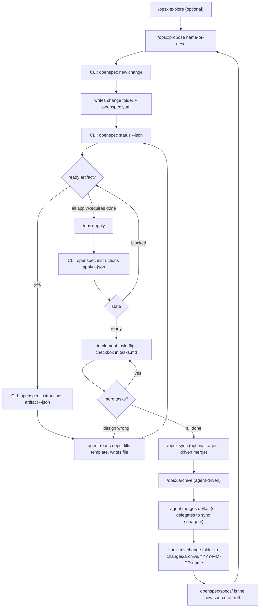
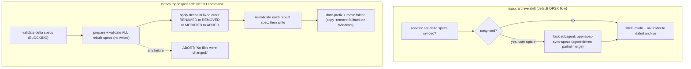
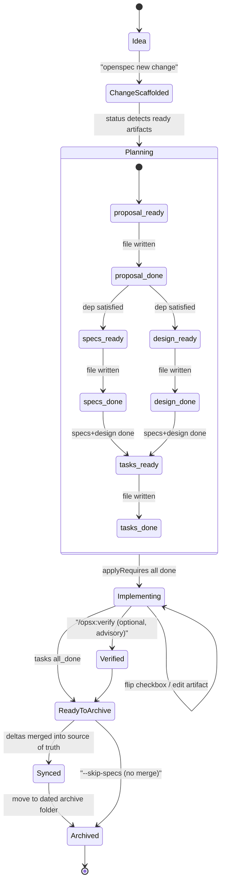
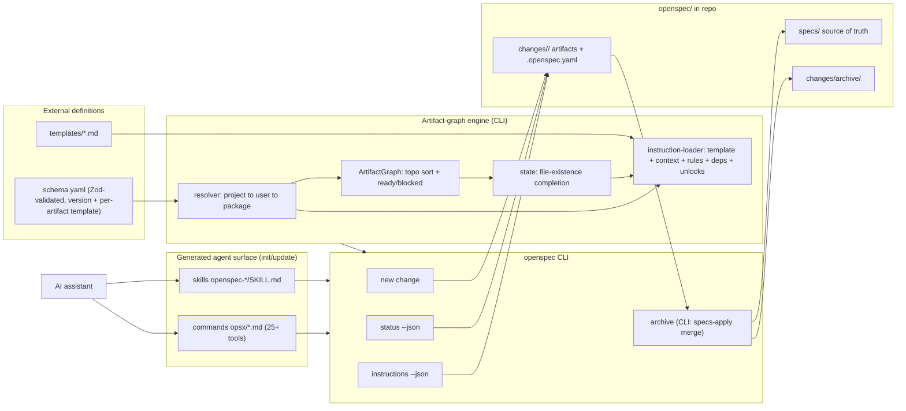

---
tags:
  - learning
  - reference
  - benchmark
related:
  - "[[tlc-spec-driven-workflow]]"
  - "[[memex-improvement-insights]]"
  - "[[mechanical-enforcement-over-prose]]"
created: 2026-06-14
---
# OpenSpec — how the Fission-AI spec-driven CLI works

**OpenSpec** (`@fission-ai/openspec`, MIT) is the structural opposite of memex and [[tlc-spec-driven-workflow]]: a **compiled TypeScript CLI** plus **external YAML+Markdown workflow schemas**, where the agent-facing skills are thin orchestrators that *shell out to the CLI* for deterministic work. Its model is **"fluid not rigid, iterative not waterfall, brownfield-first"** — it rejects phase gates. The defining mechanics: workflow **state is derived purely from which files exist** on disk (no stored phase); artifact dependencies are **enablers, not gates** (a topologically-sorted DAG that shows what's *possible* next); and the unit of work is a per-change folder of **delta specs** (`ADDED`/`MODIFIED`/`REMOVED`/`RENAMED` requirements) that **merge into a living source-of-truth spec set on archive**. Unlike memex/TLC's all-prose rigor, OpenSpec puts real teeth in a **Zod-validated schema engine + transactional merge** — *for the legacy CLI path*. This note is a benchmark for evolving memex; see [[memex-improvement-insights]].

## Context

Produced by the `2026-06-14-benchmark-spec-driven-tools` spec — source-grounded subagent analysis + adversarial verification against the clone at `tmp/openspec/` (`src/core/`, `schemas/`, `docs/`). Verifier verdict *minor_corrections*; the important one is folded in below: **OpenSpec has two distinct archive paths** that are easy to conflate.

## The core idea — actions, not phases

OPSX (the current model) treats `propose → specs → design → tasks → implement → archive` as **actions you can take anytime**, not a sequence to march through. Work state is never stored as a "phase"; the CLI recomputes done/ready/blocked live by checking **file existence** (`detectCompleted()`) against the schema DAG. You can edit any artifact at any time and the graph just recomputes — which makes the workflow trivially **resumable after a context reset** (the docs literally recommend re-running `openspec status` to recover).

## The OPSX development flow (core profile)



## Two archive paths — do not conflate

This is the subtlety the verifier flagged. The deterministic, transactional merge engine and the default skill flow are **different code paths**:



- The **CLI `openspec archive`** command (`src/core/archive.ts` + `specs-apply.ts`) is the deterministic, **abort-safe two-phase merge**: validate-all → write-all, fixed delta order, exact (whitespace-insensitive) header matching, `--skip-specs`/`--no-validate` flags. Strong correctness guarantees.
- The **`/opsx:archive` skill** (`templates/workflows/archive-change.ts`) — what the agent actually runs in the OPSX flow — does **not** call that command. It assesses sync, optionally delegates an *agent-driven* merge to the `openspec-sync-specs` skill via a `general-purpose` Task subagent, then archives with a literal `mv`. The transactional guarantees belong to the CLI path, **not** the default skill flow.

## Artifacts & the delta-spec model

```
openspec/
├── specs/<domain>/spec.md          # SOURCE OF TRUTH — ## Purpose, ### Requirement: (SHALL/MUST), #### Scenario: (WHEN/THEN)
├── changes/<name>/
│   ├── proposal.md                 # Why / What Changes / Capabilities / Impact   (DAG root, requires: [])
│   ├── specs/<cap>/spec.md         # DELTA spec: ADDED/MODIFIED/REMOVED/RENAMED   (requires: [proposal])
│   ├── design.md                   # Context, Goals/Non-Goals, Decisions, Risks   (optional; template = 4 sections)
│   ├── tasks.md                    # - [ ] N.M checklist                          (requires: [specs, design])
│   └── .openspec.yaml              # per-change metadata: schema, initiative, affected_areas, goal
├── changes/archive/YYYY-MM-DD-<name>/   # immutable audit trail, all artifacts preserved
└── config.yaml                     # default schema + project context (50KB cap) + per-artifact rules
```

The **delta spec** is the heart: instead of rewriting a whole spec, a change declares only `## ADDED/MODIFIED/REMOVED/RENAMED Requirements`. Two changes can touch the same capability without conflict (different requirements), and on archive the deltas merge into the living `openspec/specs/` base. This is what "brownfield-first" means mechanically: the spec set *grows change-by-change* and always reflects current agreed behavior.

> **Spec format is brittle:** scenarios need **exactly 4 hashtags** (`####`) or they fail silently; `MODIFIED` with partial content silently loses detail unless the full requirement block is copied; `REMOVED` on a brand-new spec is ignored.

### Artifact lifecycle (filesystem-derived states)



## The schema-driven engine



- **Skills are thin orchestrators.** They call `openspec status/instructions/new/archive` (all `--json`) and write artifact markdown; the CLI owns the DAG, validation, and merge. The *same* skill is portable across 25+ assistants because they all just run `openspec` and parse JSON.
- **Enriched instructions.** `openspec instructions <artifact> --json` returns discrete fields — `template`, project `context`, per-artifact `rules`, dependency file paths, and what each artifact *unlocks* next. (The XML wrapping `<project_context>`/`<rules>`/`<template>`/`<dependencies>`/`<unlocks>` is only the *human-text* renderer; over JSON they're separate fields.) Constraints are explicitly tagged "for YOU, do NOT copy into output."
- **Customizable without forking.** Workflows live in external YAML schemas + editable templates resolved **project-local → user-global → package built-in**; teams can `openspec schema fork` a research-first workflow and see the effect instantly with no rebuild. A second built-in schema, `workspace-planning`, exists (multi-repo coordination, beta).
- **Profiles:** the config value is **`core | custom`** (not "expanded" — that's just docs phrasing). `core` = 5 commands (propose/explore/apply/sync/archive); `custom` = any subset of all 11 (adds new/continue/ff/verify/bulk-archive/onboard).

## Enforcement mechanisms (mechanical, CLI-side)

- **Zod-validated `schema.yaml`** — required positive-int `version`, mandatory per-artifact `template`, no duplicate artifact ids, every `requires` reference must exist, and **DFS cycle detection** (rejects cyclic DAGs with the full cycle path).
- **Delta-spec validation** (`validator.ts` / `specs-apply.ts`, run by `openspec archive` + `openspec validate`): requires the section headers; each requirement needs ≥1 scenario; `ADDED`/`MODIFIED` must contain `SHALL`/`MUST`; duplicate-within-section and cross-section conflicts are hard errors; `MODIFIED`/`RENAMED` need an existing target + exact header match.
- **Transactional archive merge** (CLI): prepare+validate everything before any write; abort with "No files were changed." on failure.
- **Standalone `openspec validate --strict`** for pre-flight (warnings fail in strict mode).
- **Soft gates:** archive *warns* (and asks to confirm) on incomplete tasks/artifacts but does not block — blocking is reserved for things that would corrupt the spec. Consistent with "enablers not gates."

> Note the asymmetry: a missing scenario on a *main* spec requirement is only a WARNING, but on a *delta* `ADDED`/`MODIFIED` it's a hard ERROR.

## Distribution

`npm i -g @fission-ai/openspec` (also pnpm/yarn/bun/nix), then per-project `openspec init` — which detects the project's AI tools, applies the active profile + delivery mode (skills/commands/both), and generates tool-specific skill + command files for **25+ assistants**. `openspec update` regenerates guidance. **Repo-local `init` does NOT write an AGENTS.md block** (that's a *workspace-only* artifact from `openspec workspace setup`). Global config under XDG; user schema overrides under `~/.local/share/openspec/schemas`. Anonymous telemetry (PostHog; opt-out via `OPENSPEC_TELEMETRY=0`/`DO_NOT_TRACK=1`, auto-off in CI).

## Strengths

- Genuinely brownfield — delta specs + merge-on-archive build a **living, auditable spec base**, not one-off design docs.
- **Resumable by design** — filesystem-derived status = clean recovery after a context reset.
- **Mechanical correctness** where it counts: Zod schema validation + transactional, abort-safe merge (CLI path) → low risk of silently corrupting the source of truth.
- Highly portable: one CLI + generated skills cover 25+ assistants, no IDE/model lock-in.
- Customizable workflows without forking (external YAML schemas + templates).
- Low ceremony: core profile is 5 commands; progressive rigor (Lite vs Full specs).

## Limitations

- **No human review gate / branch-PR cycle baked in** — review is left to the host repo's normal PR process.
- The default **`/opsx:archive` skill flow does the merge agent-driven** (`mv` + prose merge); the strong transactional guarantees apply only to the *legacy CLI* `openspec archive`.
- Spec format footguns (exactly-4-hashtags, partial-`MODIFIED` data loss, ignored new-spec `REMOVED`).
- Minimal sub-agent orchestration — concurrency is by independent change folders, not delegated agents; rich behavior depends on host-tool conventions (`AskUserQuestion`/`TodoWrite`/`Task`) not all 25+ tools implement.
- **No constitution/rules-of-law layer or learnings vault** — project conventions live only in `config.yaml` context/rules; no structured reflection/knowledge-capture step.
- **Quality gates (test/lint/typecheck/build) are not enforced**; `verify` is advisory prose, never blocking.

## Comparison to memex

Shared spec-driven core, opposite shapes:

| | OpenSpec | memex |
|---|---|---|
| **Medium** | compiled CLI + Zod schemas | markdown skill + prose law |
| **Unit of work** | change folder w/ **delta specs** merged into a living spec base | spec folder = **frozen historical record** (never merged, never deleted) |
| **Gates** | gate-free ("enablers"); only hard gate = delta validity at CLI archive | gated: design approval (human) → spec self-review → quality gate → code-review-to-`lgtm` |
| **Enforcement** | **mechanical** (Zod + transactional merge) | **prose** (constitution/rules + reviewer subagents) |
| **State** | derived from file existence (no stored phase) | recorded `branch:`/`mode:`/`shipped:` in spec frontmatter |
| **Git/PR** | silent (archive = folder move) | **one branch + one PR per spec**, `/memex:new-pr`, code-review cycle |
| **Knowledge base** | the merged spec set itself | constitution + rules + **wikilinked learnings/conventions vault** + reflection + GC |
| **Customization** | fork/define workflow schemas | fixed opinionated pipeline (markdown-editable) |

Net: **OpenSpec optimizes for fluid, low-ceremony, portable spec *evolution* enforced by tooling; memex optimizes for rigorous, gated, knowledge-*accumulating* delivery enforced by law + review.** The transferable ideas (mechanical artifact validation, a spec-conformance verify dimension, filesystem-derived resumability) are distilled in [[memex-improvement-insights]].

## How to Apply

OpenSpec is the proof that the thing memex's [[mechanical-enforcement-over-prose]] learning preaches *can* be applied to the spec artifacts themselves — a CLI that validates structure and merges transactionally. When evolving memex, the highest-value borrow is **mechanical validation of spec/plan/tasks artifacts** (frontmatter, non-vague AC, AC↔task coverage) and an explicit **spec-conformance verify** dimension in code-review. Do **not** borrow the delta-merge model wholesale — it conflicts with memex's constitution ("specs never get deleted; shipped specs remain as historical record"). See the ranked, scoped recommendations in [[memex-improvement-insights]]. A richer rendered view of these diagrams lives in `openspec-workflow.html`.
