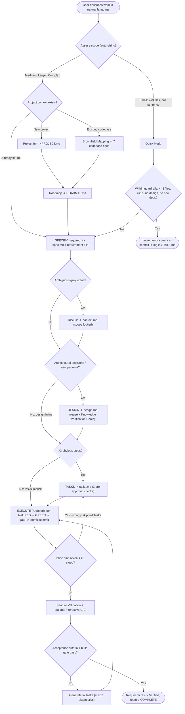
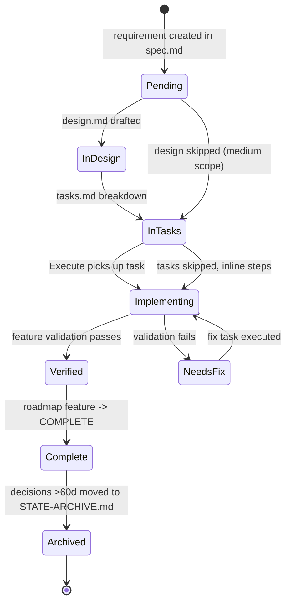

---
tags:
  - learning
  - reference
  - benchmark
related:
  - "[[openspec-workflow]]"
  - "[[memex-improvement-insights]]"
  - "[[mechanical-enforcement-over-prose]]"
  - "[[agents-md-as-map-not-encyclopedia]]"
created: 2026-06-14
---
# tlc-spec-driven — how the Tech Lead's Club spec-driven skill works

**tlc-spec-driven** (author Felipe Rodrigues, CC-BY-4.0) is memex's closest sibling: a single stack-agnostic **markdown Agent Skill** (`SKILL.md`, 216 lines, + 16 on-demand `references/*.md`) that drives an AI agent through a **complexity-adaptive** spec-driven workflow — `Specify → Design → Tasks → Execute` — where the agent *auto-sizes its own ceremony* to the change, threads **requirement-traceability IDs** from spec to commit, bakes **test-first RED→GREEN** discipline + test-integrity checks into execution, and externalizes all project memory into an on-disk `.specs/` vault. Crucially, like memex, **every rule is prose the model is asked to obey — there is zero machine enforcement** (no validator, no CLI gate); rigor depends entirely on model compliance. This note is a benchmark captured to evolve memex; see [[memex-improvement-insights]] for what we take from it and [[openspec-workflow]] for the other tool compared.

## Context

Produced by the `2026-06-14-benchmark-spec-driven-tools` spec — a deep, source-grounded analysis (subagent fan-out + adversarial verification against the cloned repo at `tmp/tlc-agent-skills/`). All claims below were re-checked against the actual `SKILL.md` + `references/*.md`; verifier verdict was *minor_corrections* and the corrections are folded in.

## The core idea — auto-sizing, not a fixed pipeline

> "The complexity is in the system, not in your workflow."

Rather than forcing every change through the full pipeline, the agent **assesses scope first** and applies only the rigor that scope demands. Two phases are always required (you must know *what* and you must *do* it); the middle two auto-skip — with a **safety valve** that re-inserts a skipped phase mid-flight if the change turns out bigger than assessed.

| Scope | Specify | Design | Tasks | Execute |
|---|---|---|---|---|
| **Small** (≤3 files, one sentence) | **Quick mode** — skip the pipeline entirely | – | – | – |
| **Medium** (clear feature, <10 tasks) | brief spec | inline (skip) | implicit (skip) | implement + verify |
| **Large** (multi-component) | full spec + requirement IDs | architecture + components | full breakdown + deps | per-task verify |
| **Complex** (ambiguity, new domain) | full spec + Discuss gray areas | research + architecture | breakdown + parallel plan | interactive UAT |

**Safety valve:** even when Tasks is skipped, Execute must first list atomic steps inline; if that reveals **>5 steps**, it STOPs and creates a real `tasks.md`. The auto-skip is self-correcting.

## The full adaptive flow



## Artifacts — the `.specs/` vault

```
.specs/
├── project/
│   ├── PROJECT.md   # vision, measurable goals, stack, scope (cap 2k tokens)
│   ├── ROADMAP.md   # milestones + features: PLANNED→IN PROGRESS→COMPLETE (3k)
│   └── STATE.md     # persistent memory: decisions AD-NNN, blockers B-NNN, lessons L-NNN, quick-tasks, deferred ideas, prefs (10k; >60d archived)
├── codebase/        # brownfield mapping (existing repos): STACK, ARCHITECTURE, CONVENTIONS, STRUCTURE, TESTING, INTEGRATIONS, CONCERNS (~19k combined)
├── features/[feat]/
│   ├── spec.md      # requirements w/ traceable IDs, WHEN/THEN/SHALL criteria
│   ├── context.md   # locked gray-area decisions (only if Discuss fired)
│   ├── design.md    # architecture + reuse (Large/Complex only)
│   └── tasks.md     # atomic tasks + deps + tests + gates (Large/Complex only)
├── quick/NNN-slug/  # ad-hoc: TASK.md + SUMMARY.md
└── HANDOFF.md       # session checkpoint, overwritten each pause (~500 tokens)
```

**Memory model:** there is no runtime store — *the filesystem is the memory*. `STATE.md` is the durable brain (numbered AD/B/L entries + a Preferences block); `PROJECT.md`/`ROADMAP.md`/`STATE.md` form a ~15k "base load" (PROJECT/ROADMAP are loaded conditionally — only STATE is truly always-on). Cross-session continuity = `HANDOFF.md` (overwritten each pause, restored on resume down to `file:line`). Requirement state lives inside `spec.md`'s traceability table; roadmap state in `ROADMAP.md`. State is *distributed across purpose-specific files*, not centralized.

### Requirement / spec lifecycle



## What makes it rigorous (all prose, no machine check)

- **Requirement-traceability IDs** — `[CATEGORY]-[NUMBER]` (e.g. `AUTH-01`) carried spec → design → task → commit → validation, with a coverage line (`X total, Y mapped, Z unmapped ⚠️`) and a status lifecycle (Pending→…→Verified). Acceptance criteria are a **numbered WHEN/THEN/SHALL list** per story, plus a *separate* traceability table (ID/Story/Phase/Status). ("WHEN/THEN is code — if you can't write it as a test, rewrite it.")
- **Three pre-approval checks in Tasks**, run *before the user sees anything*: (1) Granularity, (2) **Diagram-Definition Cross-Check** (the dependency diagram must exactly match every task's `Depends on`), (3) **Test Co-location Validation**. Two of the three (cross-check + co-location) are emitted as tables alongside the tasks.
- **Test co-location** — tests live in the *same task* as the code; "tested in another task" is explicitly **banned** as test deferral. If code can't be tested where it's created, "the task boundaries are wrong."
- **Test-first RED→GREEN** with HARD constraints: never modify/weaken/skip/delete the RED tests; a genuinely-wrong test means STOP and ask.
- **Tiered gate checks** (quick/full/build) sourced from `TESTING.md` Gate Check Commands; non-zero exit = STOP. "The test runner decides if the code is correct, not the agent's self-assessment." A greenfield fallback asks the user for test types/commands when `TESTING.md` doesn't exist.
- **Test-integrity checks** at post-gate and validation: the **test count must not silently decrease** and weakened assertions are flagged as regression — directly targeting AI failure modes.
- **Knowledge Verification Chain** — `Codebase → Project docs → Context7 MCP → Web search → flag uncertain`, with an absolute **anti-fabrication** rule: say "I don't know" rather than invent an API/pattern.
- **Scope guardrails** everywhere — the "Is this in my task definition?" heuristic, atomic Conventional Commits (one task = one commit, only its files), Quick-mode hard limits (≤3 files / ≤1h / no design / no new deps), and `SPEC_DEVIATION` markers for any divergence.
- **Interactive UAT** infers severity from the user's words (crash→Blocker, color→Cosmetic) — never asks "how bad?" — capped at 3 diagnostic iterations.

## Sub-agent strategy (first-class)

A delegation table is explicit: **delegate** research, implementing any task, parallel `[P]` tasks (one agent each), and even sequential tasks (to keep file reads/test logs out of main context); **don't delegate** planning, task creation, validation reports (need full context), or quick-mode (too small). Each sub-agent receives *only* its task definition + relevant conventions + `TESTING.md` + referenced spec/design — **not** other tasks, chat history, or `STATE.md`. It reports a fixed shape: Status / Files changed / Gate result + test counts / `SPEC_DEVIATION` / issues. Parallelism is gated by an actual **Parallelism Assessment** of test-safety, not just code deps.

## Distribution

One catalog entry in the `@tech-leads-club/agent-skills` Nx monorepo. Installed via `npx @tech-leads-club/agent-skills install -s tlc-spec-driven` (or interactive TUI), which fetches a SHA-256-hashed `skills-registry.json` from **jsDelivr (unpkg fallback)**, copies/symlinks into the chosen agent's skills dir (Claude Code: `.claude/skills`), and records a Zod-validated `.agents/.skill-lock.json`. 19 agents supported. An MCP server exposes the catalog via progressive disclosure. Security is a selling point (content hashing, lockfiles, Snyk scan).

## Strengths

- Genuinely adaptive — one tool for a one-liner *and* a multi-component feature, without forced ceremony.
- Concrete, AI-aware rigor: traceability IDs, three pre-approval checks, test co-location, tiered deterministic gates, **test-integrity checks** that target silent test deletion / weakened assertions / fabricated APIs.
- Externalized, human-readable memory with token budgets and archival zones.
- Test-first discipline encoded directly into agent behavior.
- First-class sub-agent delegation with parallelism gated by real test-safety.

## Limitations

- **No machine enforcement** — every "MANDATORY" gate/cap/constraint is prose; nothing fails a build if the agent skips a step. Same trust model as memex.
- Token caps and the <40k context target are advisory self-monitoring.
- Auto-sizing relies on the agent's own scope judgment (only the >5-step valve catches misjudgment).
- No automatic archival of completed feature folders (only `STATE.md` 60-day rule).
- **No branch/PR/mode concept** — git integration stops at atomic commits.
- Effectiveness is explicitly model-dependent.

## Comparison to memex

Siblings in philosophy (externalized markdown brain + auto-sizing by "can I describe it in one sentence?"), opposite emphases:

**TLC has that memex lacks** — graded complexity *tiers* + mid-flight safety valve; **requirement-traceability IDs** spec→commit; **test machinery** (coverage matrix, parallelism assessment, co-location, **test-integrity/count checks**); three pre-approval validation tables; interactive UAT; brownfield 7-doc mapping; anti-fabrication Knowledge Verification Chain.

**memex has that TLC lacks** — explicit **branch + PR** discipline (one branch/PR per spec, `/memex:new-pr`); **autonomous/reviewed mode**; spec self-review (spec-document-reviewer + `/memex:review-spec` against a **constitution**); a **constitution.md + rules.md** law layer and a **wikilinked learnings/conventions vault** with reflection + GC tooling (`/memex:sweep`, `/memex:link`); idempotent scaffolder + Claude-plugin distribution.

Net: **TLC is deeper on per-task engineering rigor; memex is deeper on lifecycle governance.** The high-value transfers (traceability IDs, test-integrity checks, the safety valve, anti-fabrication) are distilled in [[memex-improvement-insights]].

## How to Apply

When evolving the memex flow, mine TLC for **per-task rigor that targets AI failure modes** — start with requirement-traceability IDs and test-integrity (count/assertion) checks, both of which memex's prose quality gate currently lacks. Treat its "all-prose, no machine check" limitation as the shared weakness memex can *differentiate on* (see [[mechanical-enforcement-over-prose]]). For the concrete, ranked recommendations see [[memex-improvement-insights]]. A richer rendered view of these diagrams lives in `tlc-spec-driven-workflow.html`.
