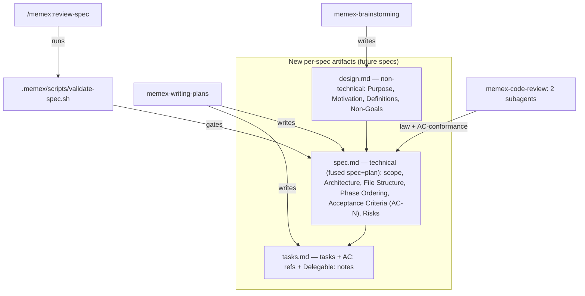

# Spec-Flow Restructure — Plan

**For this spec:** `[[2026-06-14-spec-flow-restructure/spec|spec]]`

> **For agentic workers:** implement task-by-task. Steps use checkbox (`- [ ]`) syntax. This is a markdown + shell change (no app code, no test runner in the memex repo), so "tests" here = running the new shell validator against fixtures, `diff -rq` across the 3 skill copies, and a fresh-scaffold Phase-5 run.

**Goal:** Restructure the memex per-spec artifact model (`design.md` + fused technical `spec.md` + `tasks.md` with `scope`/`AC-N`/delegation) and wire in four benchmark insights (#1 traceability, #2 test-integrity, #3 two-subagent spec-conformance review, #4 a shell artifact validator).

**Architecture:** Pure markdown + one POSIX/bash script. Edits land in two template homes (dogfood `.memex/specs/_template/*` and the install-time copies in `skills/memex/references/vault-files.md`), two AGENTS.md homes (root + `references/agents-md-template.md`), the three companion-skill copies (`.agents/skills/`, `plugins/memex/skills/`, `skills/memex/scaffold/skills/`), the `review-spec` plugin command, the scaffolder (`skills/memex/SKILL.md`) + its Phase-5/audit references, and a new `validate-spec.sh` shipped to installs at `.memex/scripts/`.

**Tech Stack:** Markdown, bash/grep/awk, the existing `npx @mermaid-js/mermaid-cli` check, `diff -rq`.

---

## Approach

The work is a coordinated edit across many files, not algorithmic code. The risk is **omission and drift**, not logic bugs — so the plan front-loads an exact File Structure (every home of every changed concept) and ends each phase with a mechanical verification (validator-against-fixtures, `diff -rq` of the 3 copies, a fresh-scaffold Phase-5 run). The five phases mirror the spec's structure and are ordered by dependency: the artifact model (Phase 1) must exist before the validator can validate it (Phase 3) and before review-spec can gate on it; the code-review and test-integrity changes (Phases 2, 4) are independent of each other but both reference the AC-ID convention introduced in Phase 1; Phase 5 reconciles enforcement (validation.md/audit/SKILL.md) and proves no drift.

This meta-spec uses the **current** artifact model (`spec.md` + `plan.md` + `tasks.md`). The new model it builds applies to future specs only.

**Fixture-location decision (resolves the spec-document-reviewer advisory):** the validator's test fixtures live at `skills/memex/scaffold/vault-scripts/fixtures/` (a `good/` folder + four `bad-*/` folders, one per failing case). They are used **only for in-repo testing of the validator** and are **NOT** scaffolded into target repos — the SKILL.md copy step copies only the single file `vault-scripts/validate-spec.sh` to `.memex/scripts/validate-spec.sh`, never the `fixtures/` sibling. This keeps the install surface to exactly one script.

## Architecture / artifact model

## File Structure

**Templates — dogfood home (`.memex/specs/_template/`):**
- Create `design.md` — non-technical template (Purpose, Motivation, Definitions, Non-Goals).
- Delete `plan.md`.
- Modify `spec.md` — technical: `scope` frontmatter (+ inline reserved-for-quick-mode note), `design: "[[design]]"` link, Architecture, File Structure, Phase Ordering, Acceptance Criteria with `AC-N`, Risks; remove Context/Problem Statement.
- Modify `tasks.md` — per-task `AC:` + `Delegable:` fields.

**Templates — install home (`skills/memex/references/vault-files.md`):** mirror all four template changes in the embedded code blocks; update the "Spec templates (3 files)" prose to the new set; update the Group A substitution list (`design.md` replaces `plan.md`).

**Flow docs:**
- Modify `AGENTS.md` (root, ≤80 lines) — reflow `### Spec flow` (design.md step, fused spec, two-subagent review).
- Modify `skills/memex/references/agents-md-template.md` — mirror the reflow + the scaffolded quality-gate test-integrity rule (Phase 4); the `scope` reserved-note.

**Companion skills (×3 copies each — `.agents/skills/memex-<n>/`, `plugins/memex/skills/<n>/`, `skills/memex/scaffold/skills/memex-<n>/`):**
- `memex-brainstorming/SKILL.md` — step 7 writes `design.md` (not `spec.md`); the spec-document-reviewer prompt retargets to the fused technical spec.
- `memex-writing-plans/SKILL.md` — produces the fused technical `spec.md` + `tasks.md` (AC-N + Delegable); fold `plan-document-reviewer-prompt.md` into the spec reviewer (remove the standalone plan reviewer).
- `memex-code-review/SKILL.md` — two-subagent orchestration (law generalist + AC-conformance) + the test-integrity rule.

**Plugin command:**
- `plugins/memex/commands/review-spec.md` — required-sections (#3) updated to the new `spec.md`; add `design.md` evaluation; invoke the validator as a feedforward gate.

**Validator + fixtures:**
- Create `skills/memex/scaffold/vault-scripts/validate-spec.sh`.
- Create `skills/memex/scaffold/vault-scripts/fixtures/{good,bad-frontmatter,bad-placeholder,bad-vague-verb,bad-unref-ac}/` (in-repo test only).

**Scaffolder + enforcement:**
- `skills/memex/SKILL.md` — add the `vault-scripts/validate-spec.sh` → `.memex/scripts/validate-spec.sh` copy + chmod step; change the `for type in spec plan tasks` loop to `spec design tasks`.
- `skills/memex/references/validation.md` — check #4 header list (if headers change), check #5 frontmatter loop → `spec/design/tasks`, check #15 bare-name list → `spec/design/tasks`, add a check that `.memex/scripts/validate-spec.sh` exists; remove any `_template/plan.md` assertion.
- `skills/memex/references/audit-checklist.md` — expected-file list `_template/{spec,plan,tasks}.md` → `{spec,design,tasks}.md`; bare-name prose; add `.memex/scripts/validate-spec.sh` as expected.

## Phase Ordering

1. **Artifact model + flow + skill reflow** — templates (both homes), AGENTS.md (both homes), brainstorming/writing-plans (×3) + reviewer fold, review-spec command. *No deps.*
2. **Code-review two-subagent (#3)** — `memex-code-review` (×3). *Depends on the AC-N convention from P1.*
3. **Validator (#4)** — `validate-spec.sh` + fixtures + SKILL.md copy step + review-spec wiring. *Depends on P1's template shape.*
4. **Test-integrity (#2)** — quality-gate rule in `agents-md-template.md` + root AGENTS.md + `memex-code-review` (×3). *Depends on P2 (same code-review file).*
5. **Sync & audit** — validation.md + audit-checklist.md command updates; `diff -rq` the 3 copies; fresh-scaffold Phase-5 run; mermaid parse-check. *Depends on P1–P4.*

## Risks / Open Decisions

- **3-copy drift** — after each skill edit, `diff -rq` the three copies; Phase 5 is the backstop. Capture a baseline `diff -rq` first ([[memex-link-copies-have-drifted]]).
- **AGENTS.md 80-line cap** — keep the reflow terse; if it would exceed 80, push detail into the skills/references. Verify with `wc -l` (Phase 1 + Phase 5).
- **Reviewer-fold loss** — diff `spec-document-reviewer-prompt.md` against `plan-document-reviewer-prompt.md` before folding; carry every distinct check forward.
- **Bash zero-match death** — `validate-spec.sh` wraps zero-match greps in `|| true` / brace blocks under `set -euo pipefail` ([[bash-strict-mode-grep-filter]]).
- No open decisions remain; the spec's Open Questions = None.
