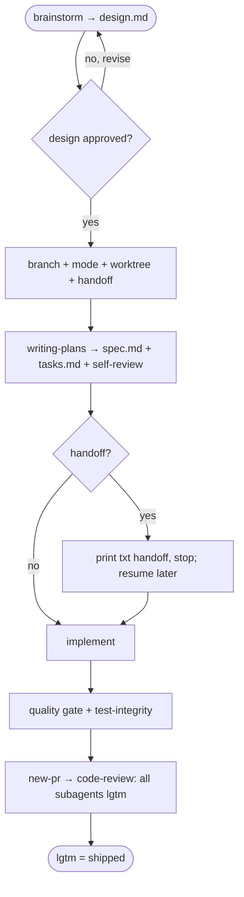

# specwright — Agent Instructions

Instructions for AI coding assistants and developers working on the specwright codebase.

**Never give up on the right solution.**

This repo builds and ships specwright (a markdown + shell skill repo, no build pipeline) and dogfoods the spec-driven workflow on itself.

## Workflow Spec Driven

Implementing, modifying, or creating something? Ask: "Can I describe the complete solution in one sentence?"
- **Yes** → implement directly.
- **Almost** (1-2 open decisions) → ask the user: spec or go direct?
- **No** → enter the Spec flow.

If the user is asking, investigating, or exploring — just answer.

### Spec flow

1. `/sw:brainstorming` → design exploration. After the design is approved, the **post-design batch** confirms the **branch name**, the **mode** (`autonomous` / `reviewed`), whether to use a **worktree**, and whether to **hand off**. Brainstorming writes `design.md` (non-technical: purpose, motivation, definitions, non-goals) — the durable write-up of the approved design, not a second review gate.
2. Create the branch — or, if a worktree was chosen, `git worktree add .specwright/worktrees/<slug>` for it (the guard recommends against a worktree when already inside a linked one; detect with `git rev-parse --git-common-dir` ≠ `--git-dir`). specwright only creates the worktree, never removes it. **One branch + one PR per spec** — design, spec, tasks, and implementation all live in it.
3. `/sw:writing-plans` → the fused technical `spec.md` (architecture, file structure, phases, `AC-N` acceptance criteria; records `scope:`/`branch:`/`mode:`/`worktree:`) + `tasks.md` (each task names its `AC:` + `Delegable:`). The agent **reviews its own spec** — the spec-document-reviewer subagent (clarity) **and** `/sw:review-spec` (the `validate-spec.sh` mechanical gate); both run in **both** modes. **No human spec review** — design approval is the only human review.
4. **Handoff (either mode)** — if handoff was chosen, once design/spec/tasks are written print a `txt` handoff prompt (summary + the three paths + mode) and stop; you `/compact` or open a new chat and paste it to resume. Never hand off before the artifacts exist.
5. **Implement.**
6. **Quality gate.** Detect the touched modules' code-quality processes (test, lint, typecheck, build — Makefile, `package.json` scripts, the area's CI) and run them all; nothing you did may break them. Logic added or changed in a tested area without a test → write the missing tests first. **Test integrity:** in a tested area the test count must not silently drop and assertions must not be weakened, skipped, or deleted to pass the gate without an in-spec justification.
7. **Deliver.** `autonomous` → open the PR (`/sw:new-pr`) and run the `/sw:code-review` cycle — several specialized review subagents that must **all** reach `lgtm` (their roles live in the skill) — hands-off, the recorded mode tells the agent to finish alone. `reviewed` → ask "open the PR and run code-review?", then the same on your go-ahead.
8. **Ship the spec.** **PR opened + code-review `lgtm` = shipped.** On `lgtm`, set the spec's own frontmatter `status: shipped` + `shipped:` date. Do this on the spec's own branch (part of its PR) — not after merge; the later merge to `main` is the maintainer's.

## Coding standard

`/sw:code-review` enforces the coding standard (Unix philosophy, meaningful comments, security). Project conventions live in `.specwright/conventions/`; specs live in `.specwright/specs/`.

## Skills and slash commands

> All entries shown in Claude Code syntax (plugin namespace `sw:`). Codex users invoke as `$sw-<verb>`; Cursor users as `@sw-<verb>`.

Commands + companion skills ship through the `sw` plugin (marketplace `specwright`, in this repo's `.claude/settings.json`). Non-Claude agents read canonical copies under `.agents/skills/sw-<name>/`.
- **`/sw:brainstorming`** — design exploration; asks autonomous/reviewed after design approval.
- **`/sw:writing-plans`** — turn an approved design into the technical spec + tasks.
- **`/sw:spec`** — enter the spec flow from the conversation.
- **`/sw:review-spec`** — external evaluator spec pass (agent self-review, both modes).
- **`/sw:new-pr`** — open the PR per the spec's mode.
- **`/sw:code-review`** — bespoke, portable review cycle to `lgtm`.
- **`/sw:update`** — sync the installed specwright with upstream (reconcile scaffolded files).
