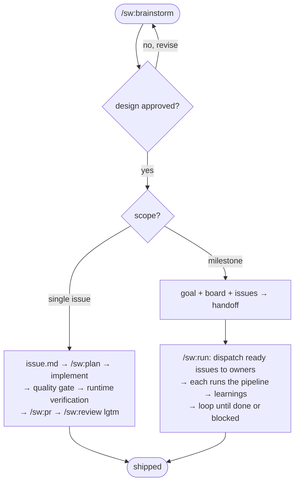

# specwright — Agent Instructions

Instructions for AI coding assistants and developers working on the specwright codebase.

**Never give up on the right solution.**

This repo builds and ships specwright (a markdown + shell skill repo, no build pipeline) and dogfoods the issue-driven workflow on itself.

## Workflow Spec Driven

Implementing, modifying, or creating something? Ask: "Can I describe the complete solution in one sentence?"
- **Yes** → implement directly.
- **Almost** (1-2 open decisions) → ask the user: issue or go direct?
- **No** → enter the Issue flow.

If the user is asking, investigating, or exploring — just answer.

### Issue flow

The **issue** is the unit of work: one folder (`issue.md` ticket with `AC-N` + `status:`, technical `spec.md`, `tasks.md`, optional `learnings.md` + any issue-specific artifacts), one branch, one PR. A large delivery is a **milestone**: `goal.md` + live `board.md` + `issues/<slug>/`, conducted in a loop by `/sw:run`.

1. `/sw:brainstorm` → open design conversation (converse first, decide at the end); design approval is the **only** human review. The agent then concludes the **scope** — single issue or milestone (it suggests, you decide) — and asks one batch: single issue = branch + worktree + handoff; milestone = worktree only.
2. **Single issue** → write `issues/YYYY-MM-DD-<slug>/issue.md`, then `/sw:plan`: just-in-time `spec.md` + `tasks.md`, self-reviewed (spec-document-reviewer subagent + `/sw:review-spec` + `validate-spec.sh` — no human gate) → implement → **quality gate** (run every test/lint/typecheck/build the touched area has; test integrity: no silent count drop, no weakened assertions) → **runtime verification** (execute it; check each `AC-N` by observed behavior; UI via browser or mark `needs-human-verification`) → `/sw:pr` → `/sw:review` to `lgtm` → set `issue.md` `status: shipped` + date. Three identical failures of one gate → stop and report; never thrash.
3. **Milestone** → write `goal.md` + `board.md` + N `issue.md`, print the mandatory handoff and stop (the planning session never conducts). `/sw:run` in a fresh session conducts: dispatch every **ready** issue (pending + deps shipped) to an issue-owner sub-agent in parallel, one worktree each (`.specwright/worktrees/<slug>`, git-ignored; specwright creates worktrees, never removes them); each owner runs step 2's pipeline and curates the issue's `learnings.md` (facts future issues inherit via their specs); blocked issues get a report on the board and the loop moves on; closeout promotes durable learnings to `CLAUDE.md`/conventions with your approval. Merging PRs stays yours.

## Coding standard

`/sw:review` enforces the coding standard (Unix philosophy, meaningful comments, security). `.specwright/conventions/` holds whatever standards this repo wants kept consistent — code style, architecture, naming, testing, any project preference — which you fill over time and `/sw:review` enforces alongside its universal rubric. Standalone issues live in `.specwright/issues/`; milestones in `.specwright/milestones/`.

## Skills and slash commands

Commands + companion skills ship through the `sw` Claude Code plugin (marketplace `specwright`), installed once, globally — nothing is copied into this repo.
- **`/sw:init`** — set up this repo's `.specwright/` vault and `CLAUDE.md` entry point.
- **`/sw:brainstorm`** — design exploration; concludes single issue vs milestone and writes the artifacts.
- **`/sw:spec`** — enter the issue flow from the conversation.
- **`/sw:plan`** — the issue pipeline: just-in-time spec + tasks, gates, delivery.
- **`/sw:run`** — conduct a milestone: dispatch ready issues, track the board, close out.
- **`/sw:review`** — bespoke, portable review cycle to `lgtm`.
- **`/sw:review-spec`** — external evaluator pass over an issue's plan (agent self-review).
- **`/sw:pr`** — open the issue's PR.

### Editing the bundled skills

Every companion skill's `SKILL.md` lives exactly **once**, under `plugins/sw/skills/<name>/` — no copy to keep in sync. Each companion skill is `user-invocable: false` (hidden from the `/` menu) and paired with a thin command at `plugins/sw/commands/<name>.md` that only reads and runs the skill's `SKILL.md`; that pairing is what makes every entry point surface as `/sw:<name>` in the picker (never a bare `/<name>`). Edit the `SKILL.md` for behavior — the command is a pure redirect and rarely changes. The artifact templates live at `plugins/sw/templates/`, the mechanical validator at `plugins/sw/scripts/validate-spec.sh`, and the reference docs at `plugins/sw/references/`. The bundled role subagents — `issue-owner`, `task-worker`, `spec-document-reviewer`, `reviewer` — live at `plugins/sw/agents/`, each pinning its `model` + `effort` and preloading (via `skills:`) the skill it runs.
