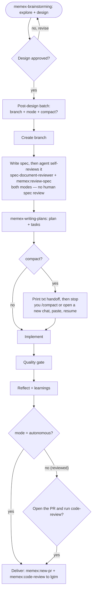

# memex

`memex` gives any repository a durable **project memory** and an explicit **spec-driven workflow**. One skill scaffolds a `.vault/` knowledge vault and an `AGENTS.md` that runs every non-trivial change through one pipeline: brainstorm → spec → plan → tasks → implement → quality gate → PR → review-to-`lgtm`. Agent-agnostic and self-hosting.

---

## Install

```bash
npx skills add ribeirogab/memex --skill memex
```

## Use

Point an agent at any repo where you want the memex installed:

> "Audit the memex in this repo and scaffold whatever is missing."

The skill is audit-first, autonomous-fix, and safe to re-run. After the first run the repo has a working `.vault/` vault, the bundled `memex-*` companion skills, the `/memex:*` slash commands, and an `AGENTS.md` — all dogfood-tested by the memex's own Phase-5 validator.

**Source:** [`skills/memex/SKILL.md`](skills/memex/SKILL.md)

## What you get

After install, the repo has an `AGENTS.md` describing a **spec-driven workflow** and a set of `/memex:*` commands and companion skills:

- **The flow** — for any non-trivial change: `brainstorming` → spec → (branch) → plan + tasks → implement → quality gate → PR → review-to-`lgtm`. **Design approval is the only human review** — the agent reviews its own spec (the spec-document-reviewer + `/memex:review-spec`) in both modes. Right after design approval, one batch asks exactly three things: the **branch name**, the execution **mode** (`autonomous` or `reviewed`), and whether to **compact** before implementing. The mode is recorded in the spec and counts as consent for committing/pushing that feature branch. It decides only the **delivery**: `autonomous` opens the PR and runs code-review to `lgtm` on its own; `reviewed` does everything the same but asks first ("open the PR and run code-review?"). **Compact works in either mode** — once spec/plan/tasks are written the agent prints a handoff prompt so you can `/compact` (or open a new chat) and implement with a clean context.
- **Commands** — `/memex:spec`, `/memex:review-spec`, `/memex:sweep`, `/memex:learn`.
- **Companion skills** — `/memex:brainstorming`, `/memex:writing-plans`, `/memex:recall`, `/memex:link`, `/memex:new-pr` (opens the spec's PR), `/memex:code-review` (reviews the branch to `lgtm`).

The spec flow, end to end (design approval is the only human review):



## Customizing

The workflow ships with opinionated defaults. They are plain markdown — change them to fit your team. Companion skills exist in three kept-in-sync copies: `.agents/skills/memex-<name>/` (canonical, what non-Claude agents read), `plugins/memex/skills/<name>/` (the Claude Code plugin copy), and `skills/memex/scaffold/skills/memex-<name>/` (what new installs receive). Edit the copy your agent loads; to change what **future** installs get, edit the `scaffold/` copy too, and keep the three in sync.

- **PR conventions (`/memex:new-pr`)** — title/body format, the draft-vs-ready choice, labels, the PR-template fill, push behavior all live in the `memex-new-pr` `SKILL.md`. Edit it to change how PRs are opened (e.g. write the body in another language, change the default base branch, or add labels).
- **Code-review rules (`/memex:code-review`)** — there are two levers. (1) **What gets flagged** is the project law the reviewer reads: your installed repo's `.vault/rules.md`, `.vault/constitution.md`, and `.vault/conventions/` — edit those to change the standard. (2) **How it reviews** — the severity classes (`blocker`/`suggestion`/`nitpick`/`question`), the blocker calibration, and the output format — lives in the `memex-code-review` `SKILL.md`.
- **The spec-flow steps** — the 8-step flow is documented in `AGENTS.md` under `### Spec flow`. To change the steps for an already-installed repo, edit that block; to change what new installs get, edit `### Spec flow` in `skills/memex/references/agents-md-template.md` (keep the two consistent). The `autonomous`/`reviewed` switch is wired across the three `memex-brainstorming` `SKILL.md` copies and the spec template's `branch:`/`mode:` fields, so deeper changes to mode behavior touch those too.

## Repository layout

```
memex/
├── skills/memex/            # the skill: SKILL.md, references/, scaffold/, scripts/
├── plugins/memex/           # Claude Code plugin — /memex:* commands (commands/) + companion skills (skills/)
├── .claude-plugin/          # marketplace manifest
├── LICENSE                  # MIT
├── NOTICE.md                # attribution for vendored validator scripts
├── CONTRIBUTING.md
├── CODE_OF_CONDUCT.md
├── SECURITY.md
└── README.md
```

The repository also contains `.agents/`, `.claude/`, and `.vault/` — local dirs used to dogfood memex on its own development (the bundled companion skills, the per-agent symlinks, and the maintainer's knowledge vault). They are not what `npx skills add` installs.

## License

This repository's original work is licensed under the [MIT License](LICENSE). The vendored validator scripts under `skills/memex/scripts/` are Apache-2.0; see [`NOTICE.md`](NOTICE.md) for attribution.

## Contributing

Pull requests welcome — see [`CONTRIBUTING.md`](CONTRIBUTING.md) for scope, the quality bar, and the per-PR checklist. By participating, you agree to the [Code of Conduct](CODE_OF_CONDUCT.md). Security concerns go to [`SECURITY.md`](SECURITY.md).
