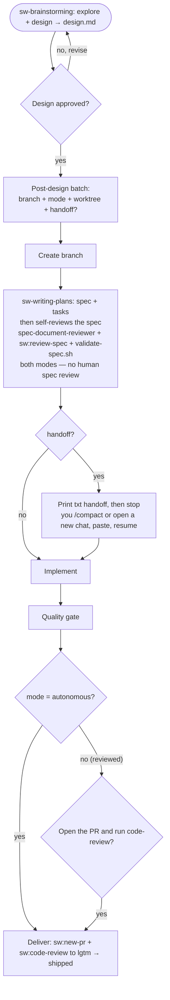

# specwright

`specwright` gives any repository an explicit **spec-driven workflow** — every non-trivial change runs through one pipeline: brainstorm → design → spec + tasks → implement → quality gate → PR → review-to-`lgtm`. Agent-agnostic and self-hosting.

---

## Install

From your project root:

```bash
curl -fsSL https://raw.githubusercontent.com/ribeirogab/specwright/main/install.sh | sh
```

It installs the scaffolder skill (`.agents/skills/sw/` plus the `.claude/skills/sw` symlink) and enables the `sw` plugin in `.claude/settings.json`. Then open the repo in your agent and run `/sw` to audit and scaffold the `.specwright/` vault. The plugin (`/sw:spec`, `/sw:new-pr`, …) installs when Claude Code trusts the workspace.

## Use

Point an agent at any repo where you want specwright installed:

> "Audit specwright in this repo and scaffold whatever is missing."

The skill is audit-first, autonomous-fix, and safe to re-run. After the first run the repo has a working `.specwright/` vault, the bundled `sw-*` companion skills, the `/sw:*` slash commands, and an `AGENTS.md` — all dogfood-tested by specwright's own validator.

**Source:** [`skills/sw/SKILL.md`](skills/sw/SKILL.md)

## What you get

After install, the repo has an `AGENTS.md` describing a **spec-driven workflow** and a `.specwright/` vault that holds only `conventions/` (project-specific conventions) and `specs/` (dated spec folders) — plus a set of `/sw:*` commands and companion skills:

- **The flow** — for any non-trivial change: `brainstorming` → design → (branch) → spec + tasks → implement → quality gate → PR → review-to-`lgtm`. **Design approval is the only human review** — the agent reviews its own spec (the spec-document-reviewer + `/sw:review-spec` + the `validate-spec.sh` mechanical gate) in both modes. Right after design approval, one batch asks exactly four things: the **branch name**, the execution **mode** (`autonomous` or `reviewed`), whether to use a **worktree** (a specwright-native checkout under `.specwright/worktrees/`, default yes unless already inside a linked worktree), and whether to **hand off** before implementing. The mode is recorded in the spec and counts as consent for committing/pushing that feature branch. It decides only the **delivery**: `autonomous` opens the PR and runs code-review to `lgtm` on its own; `reviewed` does everything the same but asks first ("open the PR and run code-review?"). **Handoff works in either mode** — once design/spec/tasks are written the agent prints a handoff prompt so you can `/compact` (or open a new chat) and implement with a clean context.
- **Commands** — `/sw:spec`, `/sw:review-spec`.
- **Companion skills** — `/sw:brainstorming`, `/sw:writing-plans`, `/sw:new-pr` (opens the spec's PR), `/sw:code-review` (reviews the branch to `lgtm`), `/sw:update` (syncs the install with upstream).

The spec flow, end to end (design approval is the only human review):



## Customizing

The workflow ships with opinionated defaults. They are plain markdown — change them to fit your team. Companion skills exist in three kept-in-sync copies: `.agents/skills/sw-<name>/` (canonical, what non-Claude agents read), `plugins/sw/skills/<name>/` (the Claude Code plugin copy), and `skills/sw/scaffold/skills/sw-<name>/` (what new installs receive). Edit the copy your agent loads; to change what **future** installs get, edit the `scaffold/` copy too, and keep the three in sync.

- **PR conventions (`/sw:new-pr`)** — title/body format, the draft-vs-ready choice, labels, the PR-template fill, push behavior all live in the `sw-new-pr` `SKILL.md`. Edit it to change how PRs are opened (e.g. write the body in another language, change the default base branch, or add labels).
- **Code-review rules (`/sw:code-review`)** — there are two levers. (1) **Project conventions** the reviewer reads: your installed repo's `.specwright/conventions/` — edit those to change the project-specific standard. (2) **The universal rubric** — the embedded rubric and severity classes (`blocker`/`suggestion`/`nitpick`/`question`), the blocker calibration, and the output format — live in the `sw-code-review` `SKILL.md` (Unix philosophy + meaningful comments + security are baked into code-review now).
- **The spec-flow steps** — the flow is documented in `AGENTS.md` under `### Spec flow`. To change the steps for an already-installed repo, edit that block; to change what new installs get, edit `### Spec flow` in `skills/sw/references/agents-md-template.md` (keep the two consistent). The `autonomous`/`reviewed` switch is wired across the three `sw-brainstorming` `SKILL.md` copies and the spec template's `branch:`/`mode:` fields, so deeper changes to mode behavior touch those too.

## Repository layout

```
specwright/
├── skills/sw/               # the scaffolder skill: SKILL.md, references/, scaffold/, scripts/
├── plugins/sw/              # Claude Code plugin — /sw:* commands (commands/) + companion skills (skills/)
├── .claude-plugin/          # marketplace manifest
├── LICENSE                  # MIT
├── NOTICE.md                # attribution for vendored validator scripts
├── CONTRIBUTING.md
├── CODE_OF_CONDUCT.md
├── SECURITY.md
└── README.md
```

The repository also contains `.agents/`, `.claude/`, and `.specwright/` — local dirs used to dogfood specwright on its own development (the bundled companion skills, the per-agent symlinks, and the maintainer's spec vault). They are not what the installer puts in your repo.

## License

This repository's original work is licensed under the [MIT License](LICENSE). The vendored validator scripts under `skills/sw/scripts/` are Apache-2.0; see [`NOTICE.md`](NOTICE.md) for attribution.

## Contributing

Pull requests welcome — see [`CONTRIBUTING.md`](CONTRIBUTING.md) for scope, the quality bar, and the per-PR checklist. By participating, you agree to the [Code of Conduct](CODE_OF_CONDUCT.md). Security concerns go to [`SECURITY.md`](SECURITY.md).
