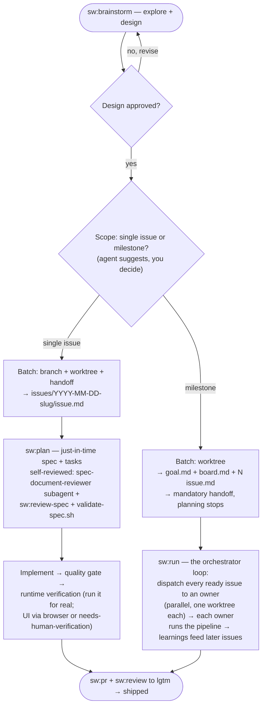

# specwright

`specwright` is a **Claude Code plugin** that gives any repository an explicit **issue-driven workflow** — every non-trivial change becomes an **issue** (1 issue = 1 branch = 1 PR) running through one pipeline: brainstorm → issue → spec + tasks → implement → quality gate → runtime verification → PR → review-to-`lgtm`. Large deliveries become **milestones**: a goal, a live board, and issues conducted in a loop by an orchestrator. Self-hosting.

---

## Install

Install the plugin once, globally, from Claude Code:

```bash
claude plugin marketplace add ribeirogab/specwright
claude plugin install sw@specwright
```

Every `/sw:*` command is now available in any repository — nothing is copied onto disk for this step.

## Use

Open the repo you want specwright in and run:

```bash
/sw:init
```

This scaffolds the `.specwright/` vault (`conventions/`, `issues/`, `milestones/`) and writes an entry point stating the plugin requirement. It **asks a commit mode**: **shared** (default — a committed `CLAUDE.md` and committed vault) or **local** (a git-ignored `CLAUDE.local.md` and git-ignored vault, for using specwright inside a repo you don't own — only the `.gitignore` change is committed). It writes no machine configuration — no `.claude/settings.json` edits, no files copied from the plugin. `/sw:init` is idempotent — re-run it any time (it re-asks the mode); it fills in what is missing and leaves existing content untouched. Milestone conduction (`/sw:run`) needs `shared` mode.

**Source:** [`plugins/sw/`](plugins/sw/)

## What you get

After running `/sw:init` the repo has:

- an **entry point** describing the issue-driven workflow (`CLAUDE.md` in shared mode, or a git-ignored `CLAUDE.local.md` in local mode),
- a **`.specwright/` vault** holding `conventions/` (whatever standards the repo wants kept consistent — you fill it, `/sw:review` enforces it), `issues/` (dated standalone-issue folders), and `milestones/` (dated milestone folders), and
- every **`/sw:*` command** below, already available from the globally installed plugin:

| Command | What it does |
|---|---|
| `/sw:init` | Scaffold or audit the `.specwright/` vault and the entry point (`CLAUDE.md`, or git-ignored `CLAUDE.local.md` in **local** mode) in the current repo. Asks a shared/local commit mode. Idempotent. |
| `/sw:brainstorm` | Explore intent and design before any non-trivial change → an issue or a milestone. |
| `/sw:spec` | Turn the current conversation into an issue and enter the flow. |
| `/sw:plan` | The issue pipeline: just-in-time `spec.md` + `tasks.md`, gates, delivery. |
| `/sw:run` | Conduct a milestone: dispatch every ready issue, track the board, close out. |
| `/sw:review` | Review the branch diff with find-only subagents until `lgtm`. |
| `/sw:review-spec` | External-evaluator pass over an issue's plan — flags vagueness, scope creep, drift. |
| `/sw:pr` | Open the issue's PR — branch/base, push, PR template, Conventional-Commit title. |

## How the flow works

Every non-trivial change runs through one pipeline. **Design approval is the only human review** — everything after it runs on its own; your other control points are merging the PRs and the circuit-breaker reports.


```mermaid
flowchart TD
    A(["sw:brainstorm — explore + design"]) --> B{"Design approved?"}
    B -- "no, revise" --> A
    B -- yes --> C{"Scope: single issue or milestone?<br/>(agent suggests, you decide)"}
    C -- "single issue" --> D["Batch: branch + worktree + handoff<br/>→ issues/YYYY-MM-DD-slug/issue.md"]
    D --> E["sw:plan — just-in-time spec + tasks<br/>self-reviewed: spec-document-reviewer subagent +<br/>sw:review-spec + validate-spec.sh"]
    E --> F["Implement → quality gate →<br/>runtime verification (run it for real;<br/>UI via browser or needs-human-verification)"]
    F --> G(["sw:pr + sw:review to lgtm → shipped"])
    C -- milestone --> H["Batch: worktree<br/>→ goal.md + board.md + N issue.md<br/>→ mandatory handoff, planning stops"]
    H --> I["sw:run — the orchestrator loop:<br/>dispatch every ready issue to an owner<br/>(parallel, one worktree each) → each owner<br/>runs the pipeline → learnings feed later issues"]
    I --> G
```

A few things worth knowing:

- **One human gate.** You approve the design — nothing else. The agent reviews its *own* plan (the spec-document-reviewer subagent + `/sw:review-spec` + the `validate-spec.sh` mechanical gate). Design approval is the standing consent to commit, push, open the PR, and review to `lgtm`.
- **Issues everywhere.** The unit of work is one folder — `issue.md` (ticket + `AC-N` + `status:`), `spec.md`, `tasks.md`, optional `learnings.md`, plus any issue-specific artifacts (e.g. `findings.md`, `evidence/`) — identical standalone and inside milestones.
- **Milestones run as a loop.** The orchestrator (`/sw:run`) never touches code: it dispatches issue owners, tracks the live `board.md`, carries curated learnings from shipped issues into later plans, and stops on circuit breakers (three identical failures → `blocked` + a report) instead of thrashing.
- **Runtime verification.** Before any PR, the agent executes what it built and checks each `AC-N` by observed behavior — UI through a browser when the agent has one, otherwise the criterion is marked `needs-human-verification`, never faked.
- **Worktree.** A specwright-native checkout under `.specwright/worktrees/` — default yes; mandatory for parallel milestone dispatch.
- **Handoff.** Fresh context per phase: optional for a standalone issue, mandatory after milestone planning (the planning session never conducts — `/sw:run` resumes from the board in any new session).

## Customizing

The workflow ships with opinionated defaults — all plain markdown, so change them to fit your team.

Companion skills live in exactly **one copy** each, under `plugins/sw/skills/<name>/` — edit that file directly, no second copy to keep in sync. Each is `user-invocable: false` (hidden from the `/` menu) and fronted by a thin command at `plugins/sw/commands/<name>.md` that only reads and runs the skill; that pairing is what makes every entry point appear namespaced as `/sw:<name>` and never as a bare `/<name>`. The command is a pure redirect — behavior lives in the `SKILL.md`.

- **PR conventions (`/sw:pr`)** — title/body format, the draft-vs-ready choice, labels, the PR-template fill, push behavior all live in the `sw-pr` `SKILL.md`. Edit it to change how PRs are opened (e.g. write the body in another language, change the default base branch, or add labels).
- **Review rules (`/sw:review`)** — there are two levers. (1) **Project conventions** the reviewer reads: your installed repo's `.specwright/conventions/` — edit those to change the project-specific standard. (2) **The universal rubric** — the embedded rubric and severity classes (`blocker`/`suggestion`/`nitpick`/`question`), the blocker calibration, and the output format — live in the `sw-review` `SKILL.md` (Unix philosophy + meaningful comments + security are baked in).
- **Orchestration (`/sw:run`)** — the dispatch rules, circuit-breaker thresholds, and closeout behavior live in the `sw-run` `SKILL.md`; the board/goal/issue shapes live in `plugins/sw/templates/`.
- **Per-role model + effort (`plugins/sw/agents/`)** — each dispatched role (`issue-owner`, `task-worker`, `spec-document-reviewer`, `reviewer`) is a bundled subagent whose `model` and `effort` are pinned in its frontmatter. Edit `plugins/sw/agents/<role>.md` to run a role on a different model or reasoning effort — cheaper implementation, higher-effort review. The two chat-session roles — the milestone orchestrator and the single-issue owner — inherit your session's model/effort.
- **The issue-flow steps** — the flow is documented in this repo's own `CLAUDE.md` under `### Issue flow`. To change the steps for an already-installed repo, edit that block directly. To change what `/sw:init` generates for a repo with no existing `CLAUDE.md`, edit `### Issue flow` in `plugins/sw/references/claude-md-template.md` (keep the two consistent) — note that `/sw:init` never rewrites an existing `CLAUDE.md`'s issue-flow section; it only appends a short plugin-requirement block when one is missing.

## Repository layout

```
specwright/
├── plugins/sw/              # Claude Code plugin — /sw:* commands, companion skills, agents, templates, validator, references
├── .claude-plugin/          # marketplace manifest
├── tests/                   # install smoke tests
├── LICENSE                  # MIT
├── NOTICE.md                # attribution for the two vendored Apache-2.0 scripts
├── CONTRIBUTING.md
├── CODE_OF_CONDUCT.md
├── SECURITY.md
└── README.md
```

The repository also contains `CLAUDE.md`, `.claude/`, and `.specwright/` — files and dirs used to dogfood specwright on its own development (the entry-point contract and the maintainer's spec vault). They are not something `/sw:init` puts in your repo automatically; running `/sw:init` there produces the equivalent for your own project.

## License

This repository's original work is licensed under the [MIT License](LICENSE). The two vendored scripts under `plugins/sw/scripts/` (`quick_validate.py`, `package_skill.py`) are Apache-2.0; see [`NOTICE.md`](NOTICE.md) for attribution.

## Contributing

Pull requests welcome — see [`CONTRIBUTING.md`](CONTRIBUTING.md) for scope, the quality bar, and the per-PR checklist. By participating, you agree to the [Code of Conduct](CODE_OF_CONDUCT.md). Security concerns go to [`SECURITY.md`](SECURITY.md).
