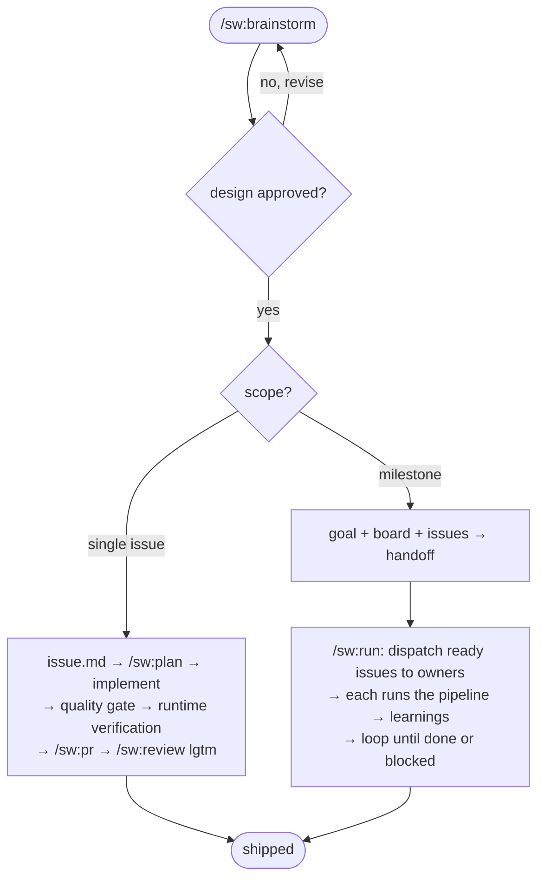

# CLAUDE.md Template

`CLAUDE.md` is the repo-root entry point Claude Code loads into every session. Load this reference when creating or repairing it.

**Entry-point filename by mode.** In `shared` mode `/sw:init` writes this content to `CLAUDE.md` (committed). In `local` mode it writes the identical content to `CLAUDE.local.md` (git-ignored, auto-loaded by Claude Code) and never touches `CLAUDE.md`. The filling rules and the size cap below apply to whichever file the mode selected. One caveat specific to `local` mode: a git-ignored `CLAUDE.local.md` is not materialized inside the worktrees `/sw:run` creates (`git worktree add` carries only tracked content) — so `/sw:run`, conducted from the checkout where you ran `/sw:init local`, copies the contract and each issue folder into the worktree it dispatches an owner into and syncs the owner's folder back into the canonical vault on return.

## Filling rules

- The intro is exactly two lines: `Instructions for AI coding assistants and developers working on the {{project}} codebase.` followed by a blank line and `**Never give up on the right solution.**`. No repo-structure paragraph.
- Fill `{{Project Name}}` and `{{project}}` from the project info `/sw:init` gathers (a manifest's declared name, falling back to the repository directory name, or asked of the user when neither resolves).
- The `### Issue flow` is fixed — the same steps for every project (it encodes the specwright delivery pipeline, not project specifics).
- The `## Skills and slash commands` section's plugin-requirement line and the two install commands are fixed text — copy them verbatim, no project-specific substitution.

Do **not** leave `{{placeholders}}` in the final file — only the two tokens above exist in this template, and both must be filled before the file is written.

## Size constraint

The final `CLAUDE.md` must be **≤ 80 lines** (target 45–70). The file is loaded into every agent session as the entry-point contract; longer than that and it crowds out conversation context and starts rotting.

When trimming to fit:

- Tighten body prose rather than dropping a required section header.
- Replace any longer narrative inside a section with a one-line pointer (e.g., a project convention in `.specwright/conventions/`).
- Never drop a required section header.

## Required section headers

None of these may be missing:

- `## Workflow Spec Driven`
- `## Coding standard`
- `## Skills and slash commands`

## Template

````markdown
# {{Project Name}} — Agent Instructions

Instructions for AI coding assistants and developers working on the {{project}} codebase.

**Never give up on the right solution.**

## Workflow Spec Driven

Implementing, modifying, or creating something? Ask: "Can I describe the complete solution in one sentence?"
- **Yes** → implement directly.
- **Almost** (1-2 open decisions) → ask the user: issue or go direct?
- **No** → enter the Issue flow.

If the user is asking, investigating, or exploring — just answer.

### Issue flow

The **issue** is the unit of work: one folder (`issue.md` ticket with `AC-N` + `status:`, technical `spec.md`, `tasks.md`, optional `learnings.md` + any issue-specific artifacts), one branch, one PR. A large delivery is a **milestone**: `goal.md` + live `board.md` + `issues/<slug>/`, conducted in a loop by `/sw:run`.

1. `/sw:brainstorm` → open design conversation (converse first, decide at the end); design approval is the **only** human review. The agent then concludes the **scope** — single issue or milestone (it suggests, you decide) — and asks one batch: single issue = branch + worktree + handoff; milestone = worktree only.
2. **Single issue** → write `issues/YYYY-MM-DD-<slug>/issue.md`, then `/sw:plan`: just-in-time `spec.md` + `tasks.md`, self-reviewed (spec-document-reviewer subagent + `/sw:review-spec` + `validate-spec.sh` — no human gate) → implement → **quality gate** (run every test/lint/typecheck/build the touched area has; test integrity: no silent count drop, no weakened assertions) → **runtime verification** (execute it; check each `AC-N` by observed behavior; UI via browser or mark `needs-human-verification`) → `/sw:pr` → `/sw:review` to `lgtm` → set `issue.md` `status: shipped` + date. Three identical failures of one gate → stop and report; never thrash.
3. **Milestone** → write `goal.md` + `board.md` + N `issue.md`, print the mandatory handoff and stop (the planning session never conducts). `/sw:run` in a fresh session conducts: dispatch every **ready** issue (pending + deps shipped) to an issue-owner sub-agent in parallel, one worktree each (`.specwright/worktrees/<slug>`, git-ignored; specwright creates worktrees, never removes them); each owner runs step 2's pipeline and curates the issue's `learnings.md` (facts future issues inherit via their specs); blocked issues get a report on the board and the loop moves on; closeout promotes durable learnings to `CLAUDE.md`/conventions with your approval. Merging PRs stays yours.



## Coding standard

`/sw:review` enforces the coding standard (Unix philosophy, meaningful comments, security). `.specwright/conventions/` holds whatever standards this repo wants kept consistent — code style, architecture, naming, testing, any project preference — which you fill over time and `/sw:review` enforces alongside its universal rubric. Standalone issues live in `.specwright/issues/`; milestones in `.specwright/milestones/`.

## Skills and slash commands

This repository requires the `sw` Claude Code plugin — every `/sw:*` command below comes from it, globally, with nothing copied into this repo. If these commands are unavailable, install the plugin once:

```
claude plugin marketplace add ribeirogab/specwright
claude plugin install sw@specwright
```

- **`/sw:brainstorm`** — design exploration; concludes single issue vs milestone and writes the artifacts.
- **`/sw:spec`** — enter the issue flow from the conversation.
- **`/sw:plan`** — the issue pipeline: just-in-time spec + tasks, gates, delivery.
- **`/sw:run`** — conduct a milestone: dispatch ready issues, track the board, close out.
- **`/sw:review`** — bespoke, portable review cycle to `lgtm`.
- **`/sw:review-spec`** — external evaluator pass over an issue's plan (agent self-review).
- **`/sw:pr`** — open the issue's PR.
````
