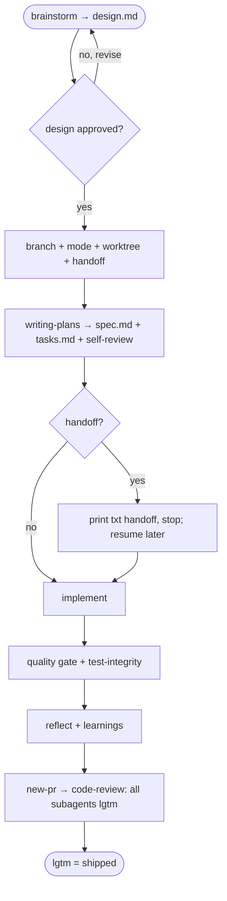

# AGENTS.md Template

`AGENTS.md` is the universal agent entry point at the repo root — it must work for any AI agent, not just Claude Code. Load this reference when creating, repairing, or auditing it.

## Filling rules

- The intro is exactly two lines: `Instructions for AI coding assistants and developers working on the {{project}} codebase.` followed by a blank line and `**Never give up on the right solution.**`. No repo-structure paragraph.
- Fill `{{Project Name}}` and `{{project}}` from the project info gathered in Prerequisites.
- The `### Spec flow` is fixed — the same 9 steps for every project (it encodes the memex delivery pipeline, not project specifics).

Do **not** leave `{{placeholders}}` in the final file. Phase 5 validation will catch them.

## Size constraint

The final `AGENTS.md` must be **≤ 80 lines** (target 45–70). The file is loaded into every agent session as the entry-point contract; longer than that and it crowds out conversation context, restates content that belongs in `.memex/`, and starts rotting (see `.memex/learnings/agents-md-as-map-not-encyclopedia.md`). Phase 5 validation enforces the cap.

When trimming to fit:

- Tighten body prose rather than dropping a required section header.
- Replace any longer narrative inside a section with a one-line pointer into `.memex/` (e.g., "See `.memex/learnings/X.md` for the full story").
- Never drop a required section header — the validator checks for all of them.

## Required section headers

The audit checklist (`references/audit-checklist.md`) checks for these section headers — none may be missing:

- `## Workflow Spec Driven`
- `## Non-negotiable rules`
- `## Vault — read from it, write to it`
- `## Skills and slash commands`

## Template

````markdown
# {{Project Name}} — Agent Instructions

Instructions for AI coding assistants and developers working on the {{project}} codebase.

**Never give up on the right solution.**

## Workflow Spec Driven

Before any work, read `.memex/_index/home.md` (project knowledge), `.memex/constitution.md` (non-negotiables), and `.memex/rules.md` (operational rules). `.memex/spec-driven-development.md` is the full guide to the flow below (artifacts, the 9 steps, scope/delegation tables, gates).

Implementing, modifying, or creating something? Ask: "Can I describe the complete solution in one sentence?"
- **Yes** → implement directly.
- **Almost** (1-2 open decisions) → ask the user: spec or go direct?
- **No** → enter the Spec flow.

If the user is asking, investigating, or exploring — just answer.

### Spec flow

1. `memex-brainstorming` → design exploration. After the design is approved, the **post-design batch** confirms the **branch name**, the **mode** (`autonomous` / `reviewed`), whether to use a **worktree**, and whether to **hand off**. Brainstorming writes `design.md` (non-technical: purpose, motivation, definitions, non-goals) — the durable write-up of the approved design, not a second review gate.
2. Create the branch — or, if a worktree was chosen, `git worktree add .memex/worktrees/<slug>` for it (the guard recommends against a worktree when already inside a linked one; detect with `git rev-parse --git-common-dir` ≠ `--git-dir`). memex only creates the worktree, never removes it. **One branch + one PR per spec** — design, spec, tasks, implementation, and learnings all live in it.
3. `memex-writing-plans` → the fused technical `spec.md` (architecture, file structure, phases, `AC-N` acceptance criteria; records `scope:`/`branch:`/`mode:`/`worktree:`) + `tasks.md` (each task names its `AC:` + `Delegable:`). The agent **reviews its own spec** — the spec-document-reviewer subagent (clarity) **and** `/memex:review-spec` (constitution + the `validate-spec.sh` mechanical gate); both run in **both** modes. **No human spec review** — design approval is the only human review.
4. **Handoff (either mode)** — if handoff was chosen, once design/spec/tasks are written print a `txt` handoff prompt (summary + the three paths + mode) and stop; you `/compact` or open a new chat and paste it to resume. Never hand off before the artifacts exist.
5. **Implement.**
6. **Quality gate.** Detect the touched modules' code-quality processes (test, lint, typecheck, build — Makefile, `package.json` scripts, the area's CI) and run them all; nothing you did may break them. Logic added or changed in a tested area without a test → write the missing tests first. **Test integrity:** in a tested area the test count must not silently drop and assertions must not be weakened, skipped, or deleted to pass the gate without an in-spec justification.
7. Reflect; write learnings to `.memex/learnings/` if genuinely useful, without asking — part of delivery. Nothing useful → say "No new learnings".
8. **Deliver.** `autonomous` → open the PR (`/memex:new-pr`) and run the `memex:code-review` cycle — several specialized review subagents that must **all** reach `lgtm` (their roles live in the skill) — hands-off, the recorded mode tells the agent to finish alone. `reviewed` → after reflect, ask "open the PR and run code-review?", then the same on your go-ahead.
9. **Ship the spec.** **PR opened + code-review `lgtm` = shipped.** On `lgtm`, set the spec's frontmatter `status: shipped` + `shipped:` date and move its entry to **Shipped** in `.memex/_index/specs.md`. Do this on the spec's own branch (part of its PR) — not after merge; the later merge to `main` is the maintainer's.



## Non-negotiable rules

All in `.memex/rules.md` — philosophy, git, security, code. Security and architecture are detailed in `.memex/constitution.md`.

## Vault — read from it, write to it

`.memex/` is the project brain. Stuck? Search `learnings/`, `conventions/`, `rules.md`, the relevant spec, and the constitution **before** guessing or asking the user. A non-obvious discovery (gotcha, constraint, surprising behavior) → an atomic note in `.memex/learnings/` (template in `.memex/templates/`), indexed in `.memex/_index/learnings.md`, linked to its spec with a wikilink — without asking permission. On a shipped spec, run the reflection step: one note per non-obvious thing, or say "No new learnings".

## Skills and slash commands

> All memex entries shown in Claude Code syntax (plugin namespace `memex:`). Codex users invoke as `$memex-<verb>`; Cursor users as `@memex-<verb>`.

Commands + companion skills ship through the `memex` plugin (marketplace `memex`, in this repo's `.claude/settings.json`). Non-Claude agents read canonical copies under `.agents/skills/memex-<name>/`.
- **`/memex:brainstorming`** — design exploration; asks autonomous/reviewed after design approval.
- **`/memex:writing-plans`** — turn an approved design into the technical spec + tasks.
- **`/memex:recall`** / **`/memex:link`** — vault reconnaissance / cross-link analysis.
- **`/memex:spec`** — enter the spec flow from the conversation.
- **`/memex:review-spec`** — external evaluator spec pass (agent self-review, both modes).
- **`/memex:new-pr`** — open the PR per the spec's mode.
- **`/memex:code-review`** — bespoke, portable review cycle to `lgtm`.
- **`/memex:update`** — sync the installed memex with upstream (reconcile scaffolded files).
- **`/memex:sweep`** / **`/memex:learn`** — vault GC / investigate-and-save.
````
