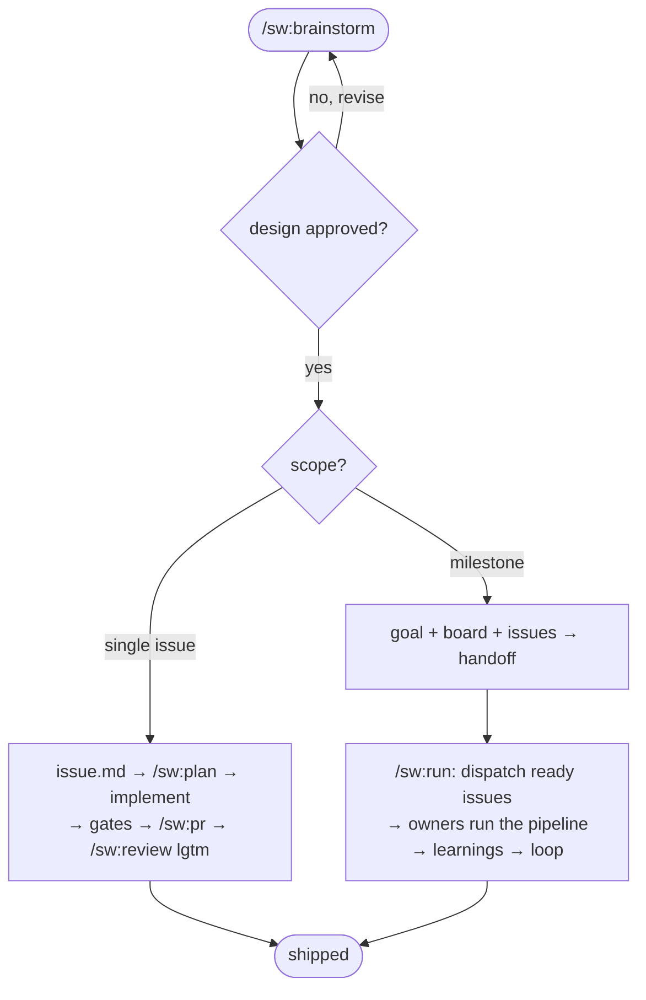

# AGENTS.md Template

`AGENTS.md` is the universal agent entry point at the repo root — it must work for any AI agent, not just Claude Code. Load this reference when creating, repairing, or auditing it.

## Filling rules

- The intro is exactly two lines: `Instructions for AI coding assistants and developers working on the {{project}} codebase.` followed by a blank line and `**Never give up on the right solution.**`. No repo-structure paragraph.
- Fill `{{Project Name}}` and `{{project}}` from the project info gathered in Prerequisites.
- The `### Issue flow` is fixed — the same steps for every project (it encodes the specwright delivery pipeline, not project specifics).

Do **not** leave `{{placeholders}}` in the final file. Phase 5 validation will catch them.

## Size constraint

The final `AGENTS.md` must be **≤ 80 lines** (target 45–70). The file is loaded into every agent session as the entry-point contract; longer than that and it crowds out conversation context and starts rotting. Phase 5 validation enforces the cap.

When trimming to fit:

- Tighten body prose rather than dropping a required section header.
- Replace any longer narrative inside a section with a one-line pointer (e.g., a project convention in `.specwright/conventions/`).
- Never drop a required section header — the validator checks for all of them.

## Required section headers

The audit checklist (`references/audit-checklist.md`) checks for these section headers — none may be missing:

- `## Workflow Spec Driven`
- `## Coding standard`
- `## Skills and slash commands`

## Template

````markdown
# {{Project Name}} — Agent Instructions

Instructions for AI coding assistants and developers working on the {{project}} codebase.

**Never give up on the right solution.**

## Workflow Spec Driven

Implementing, modifying, or creating something? Ask: "Can I describe the complete solution in one sentence?"
- **Yes** → implement directly.
- **Almost** (1-2 open decisions) → ask the user: issue or go direct?
- **No** → enter the Issue flow.

If the user is asking, investigating, or exploring — just answer.

### Issue flow

The **issue** is the unit of work: one folder (`issue.md` ticket + `AC-N` + `status:`, technical `spec.md`, `tasks.md`, optional `learnings.md`), one branch, one PR. A large delivery is a **milestone**: `goal.md` + live `board.md` + `issues/<slug>/`, conducted in a loop by `/sw:run`.

1. `/sw:brainstorm` → open design conversation; approval is the **only** human review. The agent then concludes the **scope** — single issue or milestone (it suggests, you decide) — and asks one batch: single issue = branch + worktree + handoff; milestone = worktree only.
2. **Single issue** → write `issues/YYYY-MM-DD-<slug>/issue.md`, then `/sw:plan`: just-in-time `spec.md` + `tasks.md`, self-reviewed (spec-document-reviewer subagent + `/sw:review-spec` + `validate-spec.sh` — no human gate) → implement → **quality gate** (run every test/lint/typecheck/build the touched area has; test integrity: no silent count drop, no weakened assertions) → **runtime verification** (execute it; check each `AC-N` by observed behavior; UI via browser or mark `needs-human-verification`) → `/sw:pr` → `/sw:review` to `lgtm` → set `issue.md` `status: shipped` + date. Three identical failures of one gate → stop and report; never thrash.
3. **Milestone** → write `goal.md` + `board.md` + N `issue.md`, print the mandatory handoff and stop (the planning session never conducts). `/sw:run` in a fresh session conducts: dispatch every **ready** issue (pending + deps shipped) to an issue-owner sub-agent in parallel, one worktree each (`.specwright/worktrees/<slug>`); each owner runs step 2's pipeline and writes the issue's `learnings.md` (curated facts future issues inherit via their specs); blocked issues get a report on the board and the loop moves on; closeout promotes durable learnings to `AGENTS.md`/conventions with your approval. Merging PRs stays yours.



## Coding standard

`/sw:review` enforces the coding standard (Unix philosophy, meaningful comments, security). Project conventions live in `.specwright/conventions/`; issues live in `.specwright/issues/`; milestones in `.specwright/milestones/`.

## Skills and slash commands

> All entries shown in Claude Code syntax (plugin namespace `sw:`). Codex users invoke as `$sw-<verb>`; Cursor users as `@sw-<verb>`.

Commands + companion skills ship through the `sw` plugin (marketplace `specwright`). Non-Claude agents read canonical copies under `.agents/skills/sw-<name>/`.
- **`/sw:brainstorm`** — design exploration; concludes single issue vs milestone and writes the artifacts.
- **`/sw:spec`** — enter the issue flow from the conversation.
- **`/sw:plan`** — the issue pipeline: just-in-time spec + tasks, gates, delivery.
- **`/sw:run`** — conduct a milestone: dispatch ready issues, track the board, close out.
- **`/sw:review`** — bespoke, portable review cycle to `lgtm`.
- **`/sw:review-spec`** — external evaluator pass over an issue's plan (agent self-review).
- **`/sw:pr`** — open the issue's PR.
- **`/sw:update`** — sync the installed specwright with upstream (reconcile scaffolded files).
````
